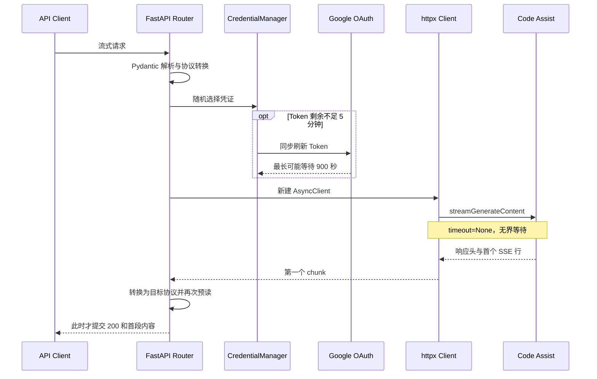
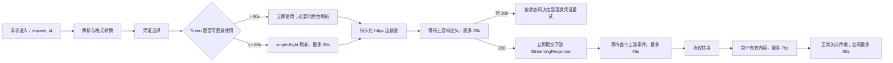

# GeminiCLI 流式首字延迟长尾治理方案

> 文档状态：dev6 已实施，待 Review
> 编写日期：2026-07-30
> 适用范围：`geminicli` 渠道的 OpenAI、Gemini、Anthropic 流式接口
> 评审目标：确认问题判断、接口行为、超时与重试策略、兼容性及上线方案

> 说明：第 1～14 节保留问题分析与早期方案演进；第 15 节是外部 Review，
> 第 16 节记录 dev6 最终实现。若早期方案与第 16 节冲突，以第 16 节和当前代码为准。

## 1. 背景

线上流式请求大多数能够在约 10 秒内返回首段有效内容，但少量请求的首字时间会达到
几十秒，极端情况下达到数百秒。目前无法从现有日志判断延迟发生在以下哪个阶段：

1. 请求解析和协议转换；
2. 凭证查询或 OAuth Token 刷新；
3. 本机连接池、事件循环或资源排队；
4. 出站代理、DNS、TCP/TLS 网络链路；
5. Google Code Assist 接收请求后的排队或模型生成；
6. 上游已经产生数据，但下游转换器过滤了空事件或不可展示内容。

因此，本次治理不能只增加一个总超时。实施顺序必须是：先把链路拆分成可观测阶段，
再消除已确认的无界等待和连接问题，最后依据数据决定是否启用凭证降权、并行竞速或渠道切换。

### 1.1 “首字”的统一定义

本文中的 TTFT（Time To First Token）统一指：

> 从 gcli2api 收到请求开始，到客户端可以收到第一段有效模型内容为止。

以下事件不计为首字：

- HTTP 200 响应头；
- SSE 空行；
- SSE comment/heartbeat；
- 被协议转换器过滤的空候选；
- 配置为不返回时被过滤的思考内容。

同时保留“上游响应头时间”和“首个上游 SSE 事件时间”两个独立指标，用于判断延迟
来自网络/Google，还是来自本地转换和内容过滤。

## 2. 当前实现与已确认风险

### 2.1 当前请求链路



客户端看到的 TTFT 实际包含了上述全部步骤，但日志只在收到第一个 chunk 后记录
“开始接收流式响应”，不能完成责任归因。

### 2.2 已确认问题

| 编号 | 位置 | 当前行为 | 影响 |
| --- | --- | --- | --- |
| P0-1 | `src/httpx_client.py` | 每个流式请求创建并关闭一个 `AsyncClient` | 无法复用 TCP/TLS 连接，高并发时增加握手、DNS 和端口压力 |
| P0-2 | `src/httpx_client.py` | 流式客户端使用 `timeout=None` | 上游不返回响应头或数据时可以无限等待 |
| P0-3 | `src/google_oauth_api.py` | Token 刷新未传专用超时，继承 `post_async` 的 900 秒 | 随机选中临期凭证时可能直接阻塞请求数百秒 |
| P0-4 | `src/credential_manager.py` | Token 剩余不足 5 分钟时在请求热路径同步刷新 | 刷新网络抖动直接进入 TTFT；并发请求可能重复刷新同一凭证 |
| P0-5 | `src/router/stream_passthrough.py` | 预读第一个转换后 chunk 才返回 `StreamingResponse` | HTTP 响应头时间和模型首字时间被合并，代理期间也收不到 heartbeat |
| P0-6 | `src/api/geminicli.py` | 异常捕获没有区分流是否已经输出 | 首块后断流时可能从头重试，造成重复内容和额外延迟 |
| P1-1 | `src/api/utils.py` 与 API 层 | 某些错误路径可能重复执行 retry sleep | 重试耗时被放大，实际退避时间不透明 |
| P1-2 | 全链路 | 没有 request ID、分阶段计时和 Google trace ID | 无法区分服务、凭证、代理与 Google 源头问题 |

上述问题足以解释本项目自身制造的长尾，因此在补齐数据前不能直接把问题归因于 Google。
同时，上游服务本身仍可能存在排队或容量抖动，需要通过对照实验确认。

### 2.3 渠道生命周期前置检查

Google 已宣布从 2026-06-18 起停止为 Gemini Code Assist Individuals、Google AI Pro 和
Google AI Ultra 个人账号提供 Gemini CLI 的 Login with Google 请求服务；Code Assist
Standard/Enterprise 不受影响：

- <https://developers.google.com/gemini-code-assist/docs/deprecations/code-assist-individuals>

因此上线前必须统计凭证等级：

- `code_assist_standard`、`code_assist_enterprise`：可继续使用本方案治理；
- `free`、个人 `pro`、个人 `ultra`：不应把 GeminiCLI OAuth 渠道作为生产主渠道，
  应迁移到项目已有的 Antigravity 渠道或正式 Gemini API；
- `unknown`：先重新检测，不能默认当作 Pro 或 Enterprise。

本次修改不自动在 GeminiCLI 与 Antigravity 之间切换，以免引入模型语义、额度和凭证
归属变化。跨渠道容灾作为后续独立变更评审。

## 3. 修改目标与非目标

### 3.1 目标

1. 每个慢请求都能明确定位到一个具体阶段；
2. 消除流式请求和 OAuth 刷新的无界等待；
3. 复用连接，降低网络握手和高并发下的尾延迟；
4. Token 刷新不再阻塞仍持有有效 Token 的正常请求；
5. 只在尚未输出有效内容时重试，杜绝中途从头重放；
6. 在不伪造“首字改善”的前提下，用 heartbeat 避免反代空闲超时；
7. 保持 OpenAI、Gemini、Anthropic 三种流式协议兼容。

### 3.2 非目标

- 不调整模型、thinking、system instruction 或生成参数；
- 不在首版默认启用 hedged request；
- 不新增 Prometheus、OpenTelemetry 或数据库延迟表；
- 不修改非流式请求的现有重试策略；
- 不在本次变更中实现跨 GeminiCLI/Antigravity 自动故障转移；
- 不承诺消除 Google 模型本身的合理计算时间，只保证等待有界且可以归因。

## 4. 总体设计



## 5. 实施内容

### 5.1 请求级追踪与性能日志

新增轻量级请求追踪对象，所有时间使用 `time.perf_counter()` 或
`time.perf_counter_ns()`，禁止使用墙上时钟计算耗时。

建议内部结构：

```text
StreamRequestTrace
  request_id
  mode / protocol / model
  input_size_bucket
  credential_id_hash
  attempt
  proxy_enabled
  token_refresh_used
  stage_timestamps
  google_trace_id
  first_content_emitted
  outcome / error_stage / status_code
```

记录以下阶段：

| 字段 | 含义 |
| --- | --- |
| `route_start_ms` | 中间件收到请求到路由函数开始，覆盖请求解析排队 |
| `convert_ms` | OpenAI/Anthropic/Gemini 请求转换耗时 |
| `credential_select_ms` | 存储后端筛选并读取凭证耗时 |
| `oauth_refresh_ms` | Token 刷新耗时；未刷新为 0 |
| `upstream_slot_wait_ms` | 等待本地上游并发槽位耗时 |
| `upstream_headers_ms` | 发起请求到收到 Google 响应头 |
| `upstream_first_event_ms` | 收到响应头到第一个有效 SSE event |
| `converter_first_content_ms` | 首个上游 event 到首段可展示内容 |
| `ttft_ms` | 请求进入到首段可展示内容 |
| `total_ms` | 流结束或失败前的总耗时 |

请求结束时记录一条 `STREAM_PERF_SUMMARY`，其中包含尝试次数、重试原因和已完成阶段的
计时；首版不单独输出逐尝试日志。示例：

```json
{
  "request_id": "01J...",
  "model": "gemini-3.5-flash",
  "protocol": "openai",
  "phase": "finished",
  "result": "success",
  "attempts": 1,
  "retry_reason": null,
  "credential": "9f8a7c21d314",
  "upstream_request_id": "...",
  "timings_ms": {
    "credential": 12.4,
    "response_headers": 531.2,
    "first_upstream_event": 9843.1,
    "conversion": 3.8,
    "first_content": 10421.7,
    "total": 18840.3
  }
}
```

安全要求：

- 凭证名只记录 `SHA-256` 前 12 位，不记录邮箱、Token、project payload；
- 不记录 prompt、图片、工具参数或完整请求体；
- Google `traceId` 只用于服务端问题关联；
- 诊断开启后，慢请求、错误请求和重试请求全部记录；正常请求受采样率控制。

### 5.2 持久化 HTTP 客户端与连接池

在 `src/httpx_client.py` 中增加真正持久化的 `AsyncClient`：

- 默认 `max_connections=100`；
- 默认 `max_keepalive_connections=20`；
- 默认 `keepalive_expiry=30s`；
- 应用关闭时调用真实存在的 `HttpxClientManager.close()`；
- 客户端取消请求时必须关闭上游 response，连接才可安全回池；
- 不在请求循环中创建 `AsyncClient`。

代理配置属于客户端构造参数。代理发生热更新时：

1. 新请求切换到以代理配置指纹标识的新 client generation；
2. 旧 generation 标记为 draining；
3. 已存在的流结束后再关闭旧客户端；
4. 日志只记录代理是否启用和配置指纹，不记录包含账号密码的代理 URL。

新增内部接口：

```text
open_stream_post(...) -> UpstreamStream

UpstreamStream
  status_code
  headers
  body_iterator
  aclose()
```

`open_stream_post` 在返回时已经收到上游响应头，但尚未消费响应体。旧的
`stream_post_async` 暂时保留为兼容包装，先迁移 GeminiCLI 路径，避免一次性改变
Antigravity 的全部行为。

### 5.3 分阶段超时

禁止继续使用 `timeout=None`。HTTPX 基础超时和业务阶段超时同时生效：

| 配置 | 默认值 | 允许范围 | 说明 |
| --- | ---: | ---: | --- |
| `CREDENTIAL_ACQUIRE_TIMEOUT` | 10s | >0 | 凭证选择和读取总等待上限 |
| `UPSTREAM_CONNECT_TIMEOUT` | 10s | 1–60s | DNS/TCP/TLS 建连上限 |
| `UPSTREAM_POOL_TIMEOUT` | 5s | 1–60s | 本地连接池等待上限 |
| `UPSTREAM_WRITE_TIMEOUT` | 30s | 1–120s | 上传请求体上限 |
| `UPSTREAM_RESPONSE_HEADER_TIMEOUT` | 20s | 1–300s | 等待 Google HTTP 响应头 |
| `UPSTREAM_FIRST_EVENT_TIMEOUT` | 45s | 1–300s | 200 后等待首个 SSE event |
| `STREAM_FIRST_CONTENT_TIMEOUT` | 75s | 1–600s | 等待首段可展示内容 |
| `UPSTREAM_STREAM_IDLE_TIMEOUT` | 90s | 5–600s | 流中两次上游数据之间的空闲上限 |
| `OAUTH_REFRESH_TIMEOUT` | 20s | 1–60s | OAuth 刷新总等待上限 |

超时分类必须保留具体异常：`connect_timeout`、`pool_timeout`、
`write_timeout`、`response_header_timeout`、`first_event_timeout`、
`first_content_timeout`、`stream_idle_timeout`、`oauth_refresh_timeout`。

为保持现有下游重试语义：

- 下游 HTTP 响应尚未提交时，超时返回 504 和 Gemini 原生错误结构，再由响应边界按协议转换；
- 下游已经收到 HTTP 200 后，不能修改状态码，按 OpenAI/Gemini/Anthropic 协议发送
  terminal SSE error，然后关闭流；
- 响应中携带 `request_id`，但不暴露凭证和内部 URL。

### 5.4 OAuth 后台刷新与 single-flight

调整 `CredentialManager.get_valid_credential()` 的刷新策略：

1. Token 剩余有效期大于 10 分钟：直接返回；
2. 剩余有效期在 60 秒至 10 分钟之间：立即返回当前 Token，并为该凭证启动后台刷新；
3. 剩余有效期不超过 60 秒：等待刷新，但最多等待 `OAUTH_REFRESH_TIMEOUT=20s`；
4. 同一凭证只允许一个刷新任务，其他调用复用同一个 Future；
5. 同步刷新超时或临时失败时只在当前请求排除该凭证，不写永久禁用状态；
6. 只有明确的 `invalid_grant`、401、403 才永久禁用凭证；
7. 刷新任务结束后必须从 single-flight 映射移除，异常必须被消费，关闭管理器时统一取消回收。

存储写回仍需完成，但应单独记录 `oauth_http_ms` 和 `credential_store_ms`，避免把远程
数据库慢误判为 Google OAuth 慢。

### 5.5 流状态机与重试边界

流式请求明确使用以下状态：

```text
PREPARING
  -> WAITING_HEADERS
  -> WAITING_FIRST_EVENT
  -> WAITING_FIRST_CONTENT
  -> STREAMING
  -> FINISHED / FAILED / CANCELLED
```

透明重试只允许发生在 `WAITING_HEADERS` 或 `WAITING_FIRST_EVENT`，并且客户端尚未收到
有效内容。默认规则：

- 连接类失败由 `STREAM_TRANSPORT_MAX_ATTEMPTS=2` 控制，包含首次请求；
- 429/500/503 和 auto-ban 状态码仍遵循现有 `RETRY_429_MAX_RETRIES` 与 SMART 策略；
- 429、500、503、配置的 auto-ban 错误和首事件前网络异常可以重试；
- 重试时排除当前凭证，必须选择不同凭证；如果没有其他凭证则直接返回 503；
- 每次重试只 sleep 一次，取消现有路径中的重复 sleep；
- `STREAMING` 后发生任何异常都不从头重放，只发送 terminal error 并结束；
- 客户端主动断开时不重试，立即取消和关闭上游请求。

该策略会减少极端情况下的“成功率换等待时间”，但能避免请求无界挂起和内容重复。
这是本次评审需要重点确认的行为变化。

### 5.6 首版保留响应边界预读

首版仍在协议转换后的响应边界预读一次，以便在提交 HTTP 200 前返回真实错误状态；不在
收到 Google HTTP 200 时提前提交下游响应，也不发送 heartbeat。响应始终增加
`X-Request-ID`；`Server-Timing` 只在诊断开关开启时增加。若生产诊断证明长尾主要来自
反向代理空闲链路，再单独评审 heartbeat 和提前提交行为。

### 5.7 暂不默认启用 hedged request

Hedged request 指首字超过阈值后，用另一凭证启动第二条相同请求，两者竞速第一个有效
内容，随后取消输家。它可以改善相互独立的 p99 长尾，但会带来：

- 额外额度和请求次数消耗；
- Google 仍可能继续计算已取消请求；
- 搜索、图片和其他计费功能可能重复消耗；
- 两条请求结果不完全一致，调试更加复杂。

首版不新增 hedge 配置或实现。只有埋点证明长尾主要发生在上游、不同凭证的慢请求相互
独立，并完成额度评估后，才另行设计和灰度。

## 6. 配置和接口变化

### 6.1 新增环境变量/配置键

除第 5.3 节的超时配置外，新增：

| 环境变量 | 默认值 | 说明 |
| --- | ---: | --- |
| `STREAM_DIAGNOSTICS_ENABLED` | `false` | 控制结构化性能日志和 `Server-Timing`，默认关闭 |
| `STREAM_LATENCY_GUARD_ENABLED` | `true` | 控制首事件、首内容、idle 超时和连接失败安全切换 |
| `STREAM_TRANSPORT_MAX_ATTEMPTS` | `2` | 首事件前连接类最大尝试数，包含首次请求 |
| `STREAM_PERF_LOG_SAMPLE_RATE` | `0.01` | 诊断开启后普通成功请求的采样率；慢请求、重试和错误全量记录 |

TTFT 新配置首版只读取环境变量并回退代码默认值，不写入存储配置，也不增加管理面板项；
配置在每个请求开始时读取，单个流中不会为每个 chunk 查询数据库。

### 6.2 外部 API 行为变化

| 场景 | 修改前 | 修改后 |
| --- | --- | --- |
| 上游无响应 | 可以等待数百秒或无限等待 | 在阶段超时后重试一次或结束 |
| Google 已返回 200、尚无内容 | 客户端还未收到 HTTP 响应 | 客户端先收到 200，并定期收到 SSE comment |
| 首内容前超时 | 最终通常转为通用 503 | 先换不同凭证一次；仍失败则 503/SSE terminal error |
| 首内容后断流 | 可能从头重试并产生重复内容 | 不重试，发送 terminal error 后结束 |
| 客户端取消 | 依赖生成器退出清理 | 明确取消上游 reader 并关闭 response |

客户端不应把 heartbeat 当模型内容。三类协议的 SDK 兼容性必须通过集成测试后才能放量。

## 7. 归因方法与运维 Runbook

| 观测结果 | 判断 | 后续动作 |
| --- | --- | --- |
| `credential_select_ms` 高 | SQLite 随机排序或远程存储慢 | 检查凭证数量、数据库连接池和查询计划 |
| `oauth_refresh_ms` 高 | OAuth 网络或存储写回慢 | 检查刷新 single-flight、代理和 OAuth 超时 |
| `upstream_slot_wait_ms` 高 | 本实例上游并发已满 | 扩容 worker/实例或调整连接上限 |
| `upstream_headers_ms` 高，绕过代理后正常 | 出站代理或本地网络问题 | 检查代理节点、DNS、TCP/TLS |
| `upstream_headers_ms` 或 `upstream_first_event_ms` 高，直连也高 | Google Code Assist 排队或模型源头 | 保留 traceId，按模型/时段汇总并考虑渠道切换 |
| 只在单个凭证哈希上慢 | 账号、project、tier 或额度路由问题 | 暂时降权该凭证并单独复测 |
| 多实例、多凭证同时变慢 | Google 或公共网络事件 | 启动渠道级熔断或切换上游 |
| `converter_first_content_ms` 高 | 上游持续返回被过滤内容 | 检查 thinking、空 candidate 和转换器行为 |
| 只有大输入/高思考模型慢 | 合理模型计算长尾 | 按模型和输入分桶设置独立 SLO |

配套提供只读诊断脚本，使用固定小 prompt 执行以下矩阵并输出 CSV：

1. 客户端经过反代访问 gcli2api；
2. 客户端绕过反代直连 gcli2api；
3. gcli2api 所在机器固定凭证直连 Code Assist；
4. 相同机器经过出站代理访问 Code Assist；
5. 并发度 1、20、100；
6. 按模型、凭证哈希和输入大小分组。

不得通过公网诊断接口暴露指定凭证能力；固定凭证测试只允许在服务端 CLI 中执行。

## 8. 代码影响范围

| 模块 | 修改内容 |
| --- | --- |
| `config.py` | 新增配置映射、校验、异步 getter 和同步热路径缓存 |
| `src/httpx_client.py` | 持久客户端、连接池、代理 generation、分阶段超时、`open_stream_post`、`close()` |
| `src/credential_manager.py` | 后台刷新、single-flight、凭证排除参数和刷新阶段计时 |
| `src/google_oauth_api.py` | OAuth 专用超时和刷新耗时拆分 |
| `src/api/geminicli.py` | 流状态机、重试边界、不同凭证切换和 traceId 记录 |
| `src/router/stream_passthrough.py` | 200 后提前返回、heartbeat、terminal error 和取消清理 |
| `src/router/geminicli/*` | 三种协议的有效首内容识别、错误格式和 request ID 透传 |
| `web.py` | 客户端生命周期关闭和可选事件循环延迟采样任务 |
| `docs/http_status_codes.md` | 补充超时、响应已提交后的 SSE 错误语义 |

为降低风险，Antigravity 暂时通过旧兼容包装调用共享客户端；连接池实现必须确保两种 mode
的 header、URL 和认证数据不会在客户端级别交叉缓存。

## 9. 测试方案

### 9.1 单元测试

新增可控的本地 ASGI/HTTP 上游，覆盖：

1. 响应头立即返回、首事件延迟；
2. 响应头本身延迟；
3. 首事件后中途断流；
4. 持续返回空行或被转换器过滤的事件；
5. 429、500、503、403 和普通 4xx；
6. 客户端在首字前和首字后取消；
7. OAuth 刷新成功、超时、临时失败、永久失败；
8. 50 个并发请求命中同一临期凭证，只产生一次刷新；
9. 重试选择不同凭证，没有其他凭证时不重复请求；
10. 每个错误路径都关闭 response 和 reader task。

### 9.2 协议集成测试

分别验证：

- OpenAI `/v1/chat/completions`；
- Gemini `streamGenerateContent`；
- Anthropic `/v1/messages`；
- 普通流式、假流式、流式抗截断；
- heartbeat 不会被 SDK 当作文本；
- terminal error 格式正确；
- 流中断不会产生重复内容；
- 上游非 200 在响应提交前仍保留正确 HTTP 状态。

### 9.3 连接与压力测试

- 连续 100 个串行请求应复用连接，不能建立 100 次 TCP/TLS；
- 并发 20、100 下没有文件描述符和连接泄漏；
- 请求取消后活跃连接、reader task 和凭证刷新 task 回到基线；
- p50 不劣化超过 5%，p95 不劣化超过 10%；
- 所有等待都能在配置预算内结束；
- 性能日志对慢请求的阶段分类覆盖率达到 100%。

## 10. 上线、观测与回滚

### 阶段 A：只上线埋点

- 保持旧业务行为，仅开启 request ID 和阶段日志；
- 采集至少 24 小时或 1,000 个流式请求；
- 按模型、输入分桶、凭证哈希、实例和代理状态计算 p50/p95/p99。

### 阶段 B：连接池与 OAuth 刷新

- 灰度 10% 实例；
- 观察连接错误、Token 刷新失败率、文件描述符和 p95；
- 24 小时无回归后逐步扩大到 50% 和 100%。

### 阶段 C：超时、重试边界与 heartbeat

- 先灰度 10%；
- 重点观察 503 比例、SSE terminal error、客户端兼容性和重复内容投诉；
- 若只是错误变快但成功率明显下降，按模型调整阈值，不能恢复 `timeout=None`。

### 回滚

- 设置 `STREAM_LATENCY_GUARD_ENABLED=false` 关闭首事件、首内容、idle 超时和连接失败切换；初始化锁、基础连接/OAuth 上限和“首事件后禁止重试”继续保留；
- 持久连接池和性能日志可继续保留，因为它们不改变响应协议；
- 诊断输出可通过 `STREAM_DIAGNOSTICS_ENABLED=false` 独立关闭；
- heartbeat 和 hedged request 首版未实现，不参与首轮回滚。

## 11. 风险与兼容性

| 风险 | 缓解措施 |
| --- | --- |
| 合理的长上下文请求被 75 秒首内容超时终止 | 按模型和输入分桶观察；必要时增加明确的模型级覆盖配置 |
| 提前返回 200 后无法再返回真实 HTTP 错误码 | 非 200 在上游响应头阶段处理；提交后统一使用协议 terminal error |
| 某些客户端不能正确忽略 SSE comment | 三协议 SDK 集成测试；可独立关闭 heartbeat |
| 持久连接复用过期或异常 socket | HTTPX 健康检查、异常关闭、短 keepalive expiry 和一次安全重试 |
| 后台 Token 刷新异常泄漏任务 | single-flight 映射清理、done callback 消费异常、应用关闭统一取消 |
| 结构化日志泄露凭证信息 | 只记录凭证哈希和分桶，不记录 Token、邮箱、prompt、代理 URL |
| 多 worker 下内存刷新状态不共享 | single-flight 只保证单 worker；远程存储写回仍是最终共享状态，文档明确边界 |
| 超时重试增加额度消耗 | 最多一次、必须不同凭证、仅首内容前、共享总预算 |

## 12. Reviewer 重点检查清单

- [ ] 是否认可“首个有效内容”作为统一 TTFT 口径；
- [ ] 是否认可个人 GeminiCLI OAuth 凭证不再作为生产主渠道；
- [ ] 20/45/75/90 秒四级默认超时是否适合当前模型和输入规模；
- [ ] 流式请求最多一次、且必须切换凭证的重试策略是否可接受；
- [ ] 是否接受上游 200 后立即向客户端提交 200 和 heartbeat 的语义变化；
- [ ] 三种协议的 terminal error 是否满足现有客户端重试逻辑；
- [ ] 持久客户端的代理热更新和 draining 是否会关闭仍在使用的流；
- [ ] Token 刷新 single-flight 是否覆盖成功、超时、取消和存储失败；
- [ ] 首内容后绝不从头重试是否在所有代码路径成立；
- [ ] request ID、凭证哈希和 Google trace ID 是否满足排障且不泄露敏感信息；
- [ ] 回滚开关是否能在不重启或最小重启成本下生效；
- [ ] 是否需要为 Pro/高思考/超长输入增加独立超时覆盖，还是先依赖数据再调整。

## 13. 验收标准

本次修改满足以下条件后方可全量：

1. 不存在 `timeout=None` 或等价无界等待；
2. OAuth 单次刷新最多 20 秒，同一 worker 内同一凭证并发只刷新一次；
3. 流式响应输出有效内容后不会发生透明重试；
4. 每个慢请求都记录 request ID、凭证匿名标识、最慢阶段和错误类别；
5. 客户端取消后上游连接和后台任务能够回收；
6. 三种协议的主流 SDK 均能忽略 heartbeat 并正确处理 terminal error；
7. 固定小 prompt 的 p50 不劣化超过 5%，p95 不劣化超过 10%；
8. 超过阈值的请求会在预算内成功、切换凭证或明确失败，不再出现数百秒无解释等待；
9. consumer tier 凭证已迁移或从 GeminiCLI 生产池移除；
10. 文档、配置示例和 HTTP 状态码说明与最终代码一致。

## 14. 参考资料

- HTTPX AsyncClient 与连接池：<https://www.python-httpx.org/async/>
- HTTPX 分阶段超时：<https://www.python-httpx.org/advanced/timeouts/>
- Google Gemini Code Assist consumer account 弃用说明：
  <https://developers.google.com/gemini-code-assist/docs/deprecations/code-assist-individuals>
- 官方 Gemini CLI Code Assist 流式实现：
  <https://github.com/google-gemini/gemini-cli/blob/main/packages/core/src/code_assist/server.ts>


---

## 15. 代码结合 Review 报告（dev5 分支）

> Review 日期：2026-07-30
> 审查分支：`origin/dev5`
> 审查范围：`src/httpx_client.py`、`src/credential_manager.py`、`src/google_oauth_api.py`、`src/api/geminicli.py`、`src/api/utils.py`、`src/router/stream_passthrough.py`、`src/router/geminicli/openai.py`、`web.py`、`config.py`

---

### 15.1 文档描述准确但缺少代码行号引用的问题

#### C-1：P0-2 / P0-3 — `timeout=None` 和 900 秒来源可精确追溯

**代码实证**

- `src/httpx_client.py:42`：`get_streaming_client(self, timeout: float = None, **kwargs)` —— 默认值即 `None`，传入 `httpx.AsyncClient` 后无界等待，**P0-2 属实**。
- `src/httpx_client.py:77`：`post_async(..., timeout: float = 900.0, ...)` —— 900 秒来源明确。
- `src/google_oauth_api.py:93`：`Credentials.refresh()` 调用 `post_async` 未传 `timeout`，继承 900 秒，**P0-3 属实**。

**修改建议**：文档 P0-2/P0-3 条目补充上述代码行引用，方便审阅者直接定位。

---

#### C-2：P0-4 — 重复刷新触发门槛，文档低估了严重性

**文档声明**：并发请求可能重复刷新同一凭证（"高并发时"）。

**代码实证**：`src/credential_manager.py:103–116` 中 `_refresh_token` 没有任何 single-flight 保护，`src/credential_manager.py:548–556` 的 `_get_or_create` 也仅做简单 `if self._instance is None` 判断，无锁保护。同一即将过期凭证被任意 **2 个并发请求**同时获取后，两者均会独立进入 `_refresh_token`，不需要"高并发"即可复现。

**修改建议**：文档将"并发请求可能重复刷新"改为"任意两个并发请求选中同一即将过期凭证时即触发重复刷新"，以准确反映代码现状。

---

#### C-3：P0-5 — 实际存在两层预读，文档只描述了一层

**代码实证**

- `src/router/geminicli/openai.py:319`：`normal_stream_generator` 内部 `await read_first_async_item(stream_gen)` —— **第 1 次预读**（等待底层第一个 Gemini SSE chunk）。
- `src/router/stream_passthrough.py:28`（由 `openai.py:390` 调用）：`build_streaming_response_or_error` 再次 `await read_first_async_item(iterator)` —— **第 2 次预读**（等待格式转换后第一个 OpenAI chunk）。

最终只有 `convert_gemini_to_openai_stream` 成功转换出第一个有效 chunk 后，客户端才能收到 HTTP 200，实际 TTFT 阻塞包含了转换层延迟。

**修改建议**：文档 P0-5 更正为"双层预读阻塞"，并说明两层的位置。

---

#### C-4：P0-6 — 首内容后仍可重试，异常路径保护不完整

**代码实证**：`src/api/geminicli.py:349` 中 `success_recorded = False` 在首个正常 chunk 时被置 `True`，但 `geminicli.py:525–530` 的 `except Exception` 分支完全不检查 `success_recorded`，直接 `continue` 重试：

```python
except Exception as e:
    if attempt < max_retries:
        await asyncio.sleep(retry_interval)
        continue   # ← 不检查 success_recorded，直接从头重试
```

网络中断发生在首个 chunk 输出之后，仍会触发从头重试，产生重复内容。**P0-6 属实，但代码中的保护缺口文档未明确说明。**

**修改建议（代码）**：在 `except Exception` 块冒头位置增加首内容检查：

```python
except Exception as e:
    if success_recorded:   # 首内容后发生异常，绝不重试
        log.error(f"[GEMINICLI STREAM] 首内容后异常，终止: {e}")
        return
    if attempt < max_retries:
        ...
```

---

#### C-5：P1-1 — 重复 sleep 路径，文档描述属实，但缺具体位置

**代码实证**：在非 smart_429 模式下，以下路径中存在重复 sleep：

1. `src/api/utils.py:182`：`handle_error_with_retry` 中 `await asyncio.sleep(retry_interval)`
2. `src/api/geminicli.py:233`：`_switch_credential_for_retry` 中预热凭证成功时 `await asyncio.sleep(retry_interval)`
3. `src/api/geminicli.py:240`：`_switch_credential_for_retry` 回退同步刷新前 `await asyncio.sleep(retry_interval)`

最坏路径（非 smart，预热失败后回退同步刷新）可触发 1 + 3 = 两次 sleep，退避时间不透明。

**修改建议**：文档 P1-1 条目补充上述三处代码位置，并在 §5.5 中明确"每次重试只 sleep 一次"的实现方案。

---

### 15.2 文档描述方案在代码中完全不存在（需从零实现）

以下功能在 dev5 分支中**完全没有实现**，文档使用"修改"措辞，实际需要从零新增：

| 编号 | 功能 | 文档章节 | 代码现状 |
|------|------|---------|---------|
| N-1 | 请求级性能追踪（`StreamRequestTrace`、`perf_counter`、`STREAM_PERF_*` 日志） | §5.1 | 完全不存在，GeminiCLI 路径仅有少量 `log.debug` |
| N-2 | 分阶段超时 8 个环境变量（`UPSTREAM_CONNECT_TIMEOUT` 等） | §5.3 | `config.py:ENV_MAPPINGS` 中一个都没有；当前流式 `timeout=None`，非流式 `timeout=300.0`，OAuth `timeout=900.0` |
| N-3 | OAuth single-flight、后台刷新、`stale_valid` 标记 | §5.4 | 完全不存在；需重写 `_should_refresh_token`、`_refresh_token`、`get_valid_credential` 三个核心方法 |
| N-4 | 持久化 HTTP 连接池（`UpstreamStream`、`open_stream_post`、`generation`/`draining`） | §5.2 | 完全不存在；`HttpxClientManager` 目前是纯工厂模式 |
| N-5 | 流状态机（`PREPARING` / `WAITING_HEADERS` / `STREAMING` 等） | §5.5 | 不存在；仅有 `success_recorded` 布尔标志，不区分阶段 |
| N-6 | heartbeat、收到上游 200 后立即提交响应、`asyncio.Queue` 读取任务 | §5.6 | 完全不存在 |
| N-7 | 5 个新环境变量（含回滚总开关 `STREAM_LATENCY_GUARD_ENABLED`） | §6.1 | 完全不存在 |

---

### 15.3 文档遗漏的现有 Bug（与本次方案强相关）

#### L-1：`web.py` 调用了不存在的 `http_client.close()`（当前即触发 AttributeError）

`web.py:119–124`：
```python
try:
    from src.httpx_client import http_client
    await http_client.close()        # HttpxClientManager 没有 close() 方法
    log.info("HTTP连接池已关闭")
except Exception as e:
    log.error(f"关闭HTTP连接池时出错: {e}")  # AttributeError 被吞掉
```

`HttpxClientManager`（`src/httpx_client.py:16–56`）没有 `close()` 方法，每次应用关闭都会触发 `AttributeError` 并被 `except` 吞掉。文档 §5.2 要求"调用真实存在的 `HttpxClientManager.close()`"——该方法目前不存在。

**修改建议**：在实现持久化连接池之前，先在 `HttpxClientManager` 中添加空的 `async def close(): pass`，避免关闭时产生噪声错误。

---

#### L-2：`_CredentialManagerSingleton._get_or_create` 存在 asyncio TOCTOU

`src/credential_manager.py:547–556`：
```python
async def _get_or_create(self) -> CredentialManager:
    if self._instance is None:       # 检查 #1
        if self._instance is None:   # 检查 #2（与 #1 完全相同，无任何保护）
            self._instance = CredentialManager()
            await self._instance.initialize()   # yield 控制权后，其他协程可能进入
```

两次 `if self._instance is None` 完全相同，没有 `asyncio.Lock`。`await self._instance.initialize()` 期间会 yield 控制权，此时其他协程看到 `self._instance` 已非 `None`，会直接返回**尚未初始化完成的实例**。

**修改建议**：
```python
_init_lock: Optional[asyncio.Lock] = None

async def _get_or_create(self) -> CredentialManager:
    if self._instance is not None:
        return self._instance
    if self.__class__._init_lock is None:
        self.__class__._init_lock = asyncio.Lock()
    async with self.__class__._init_lock:
        if self._instance is None:
            self._instance = CredentialManager()
            await self._instance.initialize()
    return self._instance
```

---

#### L-3：`_MOCK_STREAM_429` 调试开关遗留在生产代码中

`src/httpx_client.py:86`：
```python
_MOCK_STREAM_429 = False
```

硬编码调试开关，若误改为 `True` 发布，所有流式请求返回 429。文档 §8 代码影响范围未标注需要清理。

**修改建议**：删除此开关，或改为通过 `DEBUG_MODE` 环境变量控制，并在 §8 中注明需清理。

---

### 15.4 汇总：代码层问题严重性矩阵

| 编号 | 类型 | 严重性 | 涉及章节 | 问题描述 | 处理建议 |
|------|------|--------|---------|---------|---------|
| C-1 | 文档准确，缺行号 | P0 | §2.2 P0-2/P0-3 | `timeout=None` 和 900s 无界等待属实，来源可追溯 | 补充代码行引用 |
| C-2 | 文档低估严重性 | P0 | §2.2 P0-4 | 任意 2 个并发即可触发重复刷新，非"高并发时" | 更正措辞 |
| C-3 | 文档低估严重性 | P0 | §2.2 P0-5 | 实为两层预读，非一层 | 文档更正 |
| C-4 | 文档准确，保护不完整 | P0 | §2.2 P0-6 / §5.5 / §13-3 | `except Exception` 路径绕过首内容检查，违反验收标准第 3 条 | 修复代码（见 C-4 建议） |
| C-5 | 文档准确，缺行号 | P1 | §2.2 P1-1 | 重复 sleep 路径在 utils.py 与 geminicli.py 中均有 | 补充具体行号 |
| N-1 | 功能完全不存在 | P0 | §5.1 | 性能追踪系统从零开始 | 补充工作量估计 |
| N-2 | 功能完全不存在 | P0 | §5.3 | 8 个超时配置均未实现 | 标注"全新增" |
| N-3 | 功能完全不存在 | P0 | §5.4 | single-flight/后台刷新需重写三个核心方法 | 标注"重写，非小改" |
| N-4 | 功能完全不存在 | P0 | §5.2 | 连接池从零实现 | 标注"全新增" |
| N-5 | 功能完全不存在 | P1 | §5.5 | 流状态机从零实现 | — |
| N-6 | 功能完全不存在 | P1 | §5.6 | heartbeat 和 Queue 从零实现 | — |
| N-7 | 功能完全不存在 | P0 | §6.1 | 5 个新环境变量和回滚开关均未实现 | 标注"全新增" |
| L-1 | 现有 Bug，文档遗漏 | P1 | §5.2 / §8 | `web.py` 调用不存在的 `http_client.close()`，每次关闭报 AttributeError | 先补空实现 |
| L-2 | 现有 Bug，文档遗漏 | P1 | 未提及 | `_get_or_create` TOCTOU，可能返回未初始化实例 | 使用 `asyncio.Lock` |
| L-3 | 生产风险，文档遗漏 | P1 | §8 | `_MOCK_STREAM_429` 调试开关遗留 | §8 标注需清理 |

---

### 15.5 综合评价

**优点**

1. P0-1 至 P0-6、P1-1 至 P1-2 所有问题在 dev5 代码中**均有实证支撑**，问题识别准确。
2. 分阶段实施（埋点 → 连接池 → 超时/重试/heartbeat）降低上线风险，逻辑合理。
3. 非目标边界清晰，不承诺消除模型本身计算延迟。

**主要缺陷**

1. **没有任何代码行号引用**。文档作为 Review Draft 提交，但不包含任何代码位置引用，审阅者无法快速交叉验证。
2. **所有方案描述的功能在 dev5 中完全不存在**。文档语气像"在现有基础上修改"，实际上连接池、single-flight、状态机、heartbeat、埋点、分阶段超时、回滚开关这 7 个系统需要从零新增，低估了实现工作量。
3. **遗漏了 3 个已存在的现有 Bug**：`web.py:close()` 缺失（L-1）、`_get_or_create` TOCTOU（L-2）、调试开关遗留（L-3）。
4. **验收标准第 3 条（首内容后不重试）在现有代码的 `except Exception` 路径上已被违反**（C-4），方案中缺少对此路径的明确修复描述。

---

## 16. dev6 最终实施决策与结果

> 实施分支：`dev6`
> 基线：`origin/dev5@5a85e5892a679445e77125d1567f6699d845fa76`
> 实施日期：2026-07-30

### 16.1 对第 15 节 Review 的确认

| Review 项 | 最终结论与实现 |
| --- | --- |
| C-1 | 属实。流式请求不再使用 `timeout=None` 的临时客户端；通用 POST 默认值由 900 秒降为 30 秒，OAuth 刷新显式限制为 20 秒。 |
| C-2 | 属实。以 `(mode, filename)` 为键实现 OAuth single-flight，并用 `asyncio.shield()` 防止单个等待者取消共享刷新。 |
| C-3 | “两层预读”结构属实，但并非两个独立上游等待。dev6 已删除三种 GeminiCLI 协议路由和抗截断首轮的内部预读，仅保留转换完成后的响应边界预读。 |
| C-4 | 属实，但不能只增加 `if success_recorded: return`。dev6 使用“首个有效上游事件”作为禁止重放边界；边界后异常转为终止错误，绝不重新请求。 |
| C-5 | 属实。`handle_error_with_retry()` 只做决策，退避统一在凭证切换处执行一次。 |
| L-1 | 属实。实现真实共享连接池及 `HttpxClientManager.close()`，没有增加临时空实现。 |
| L-2 | 属实且原报告范围不完整。CredentialManager 与全局 StorageAdapter 均改为初始化成功后才发布。 |
| L-3 | 属实。生产代码中的 `_MOCK_STREAM_429` 已删除；没有绑定 `DEBUG_MODE`，测试改用 MockTransport。 |

### 16.2 已实施内容

1. 新增 `StreamRequestTrace`、`StreamFailure`、`StreamLatencyConfig` 和明确的流阶段。
2. 新增按代理配置换代的共享 HTTPX 连接池，旧代在活动流释放后关闭。
3. 实施凭证、OAuth、连接池、连接、写入、响应头、首事件、首内容和流空闲分阶段超时。
4. 首个有效上游事件前，连接类失败最多使用两个不同凭证；首事件后禁止重试。
5. `excluded_credentials` 在 SMART 429 关闭时同样生效，覆盖四种存储及 Redis 快速路径。
6. 保留 SMART 429 的分类、冷却、熔断、half-open、Retry-After 和 503 契约；网络超时不写入额度或风控状态。
7. OAuth 剩余 1～10 分钟时后台刷新，剩余不超过 1 分钟时阻塞等待最多 20 秒；临时错误不禁用凭证。
8. 应用退出顺序调整为先停止服务任务，再关闭凭证/存储，最后关闭 HTTP 连接池。

### 16.3 诊断开关

诊断默认关闭：

```dotenv
STREAM_DIAGNOSTICS_ENABLED=false
```

关闭时仍保留内部计时和超时控制，但不输出 `STREAM_PERF_SUMMARY` 或 `Server-Timing`。开启后：

- 慢请求、失败和发生重试的请求全部记录；
- 普通成功请求按 `STREAM_PERF_LOG_SAMPLE_RATE` 采样，默认 1%；
- 日志只记录脱敏凭证摘要和请求 ID，不记录 token、代理认证信息或请求正文。

`X-Request-ID` 始终返回，用于将客户端错误与服务端日志关联。

控制面板提供独立的“流式 TTFT 诊断”开关，持久化键为
`stream_diagnostics_enabled`，不与 `DEBUG_MODE` 联动。单 Worker 保存后立即热更新；多
Worker 保存后提示重启全部 Worker。若设置 `STREAM_DIAGNOSTICS_ENABLED`，环境变量优先，
前端开关只读并显示“环境变量已锁定”。开关状态在请求创建时形成快照，进行中的流不会因
配置变化出现日志与响应头状态不一致。

### 16.4 默认超时与错误语义

| 阶段 | 默认值 | 失败结果 |
| --- | ---: | --- |
| 凭证获取 | 10 秒 | 504 |
| OAuth 刷新 | 20 秒 | 排除当前凭证；无替代凭证时 503 |
| 连接池 / TCP / 写入 | 5 / 10 / 30 秒 | 超时 504，其他连接错误 502 |
| 响应头 / 首事件 | 20 / 45 秒 | 允许首事件前安全切换一次凭证 |
| 首个下游有效内容 | 总预算 75 秒 | 504 |
| 流中空闲 | 90 秒 | 协议原生终止错误，不重试 |

无可用凭证、容量不足和 429 重试耗尽继续返回 503。首内容后 HTTP 状态已经提交时，OpenAI/Gemini 输出 SSE error 和 `[DONE]`，Anthropic 输出 `event: error` 后关闭。

### 16.5 验证结果

- 新增 `test_streaming_latency.py`，覆盖响应头/首事件绝对预算/首内容/相邻 chunk 超时、三种协议错误、响应关闭、连接复用、代理换代、直连模式忽略宿主代理环境、200 并发 OAuth 刷新、200 并发初始化、SMART 关闭时凭证排除、单次 sleep 和首事件后禁止重试。
- 全量测试：`112 passed`（包含独立 TTFT 诊断开关、热更新、环境锁定、请求快照及前端静态检查）。
- `python -m compileall` 与 `git diff --check` 通过。

首版按决策不实现 heartbeat、收到响应头后提前提交 200 或并行 hedge；如后续诊断证明主要问题位于反向代理空闲链路，再单独设计。

## 17. 生产日志复核后的诊断增强

2026-07-30 对实际运行日志复核后，确认主要长尾来自 Google
`MODEL_CAPACITY_EXHAUSTED` 和等待上游响应头；凭证获取、OAuth 刷新和协议转换不是本批日志中的
主要瓶颈。原诊断把连接池、TCP、TLS、写入和响应头等待合并为 `response_headers`，同时缺少异常类、
状态/传输重试拆分以及下游取消后的输出量，因此升级为兼容旧字段的
`STREAM_PERF_SUMMARY schema_version=2`。

新版记录 `retries`、`last_failure`、限长 `attempt_details` 和不含内容的 `stream` 统计。
诊断开启时以 httpcore trace callback 尽力采集 pool/connect/TLS/write/header 阶段；采集不可用时
回退旧聚合耗时，诊断关闭时不安装 callback。服务端 `X-Request-ID` 仍为权威 ID，合法的下游
`X-Client-Request-ID` 或入站 `X-Request-ID` 另存为 `client_request_id`。

新增独立配置 `GEMINICLI_CAPACITY_FAST_FAIL_ENABLED` /
`geminicli_capacity_fast_fail_enabled`，默认关闭。开启后单请求遇到模型容量不足最多切换一次凭证，
第二次立即返回带 `Retry-After` 的 503；10 秒内两次容量失败打开进程内模型保护器，按
5/10/20/30 秒冷却并只允许一个 half-open 探测。容量事件不写入凭证额度、风控或永久禁用状态。
环境变量锁定前端开关；单 Worker 支持热更新，多 Worker 保存后需重启且保护状态彼此独立。

凭证日志统一使用 SHA-256 前 12 位诊断 ID，凭证状态接口同时返回 `diagnostic_id` 供管理员映射。
运行日志不得包含完整凭证文件名、邮箱、Token、Prompt、代理认证信息或完整上游错误正文。

增强实现完成后在项目 `.venv` 运行全量测试：`135 passed, 7 warnings`；同时通过
`compileall` 和 `git diff --check`。

## 18. 参照 CLIProxyAPI 的响应头长尾优化

### 18.1 原因和借鉴边界

生产日志复核显示，剩余长尾主要集中在 Google 响应头等待及其后的串行第二次尝试。
CLIProxyAPI 的可取之处是共享 transport、HTTP/2 连接复用，以及在首个有效 payload 前集中完成
上游选择；本项目保留自身已经建立的分阶段超时、类型化失败和首事件后禁止重放边界。

本轮不采用 CLIProxyAPI 的响应头无界等待，也不提前向下游提交 HTTP 200。当前单次响应头上限
仍是 20 秒；对冲默认关闭，开启后首请求等待 15 秒仍无响应头才会启动一次备用请求，因此双侧
响应头最迟约在 35 秒完成决策，另允许 2 秒事件循环调度容差。

### 18.2 HTTP/2 灰度

新增仅由环境变量控制的 `UPSTREAM_HTTP2_ENABLED=false`。HTTPX 共享连接池创建时显式传入
`http2`，连接池 generation 指纹包含代理配置和 HTTP/2 状态，变更后旧 generation 等待活动流
结束再关闭。项目直接依赖 `httpx[http2,socks]`，不再依靠 Hypercorn 间接提供 `h2`。

HTTP/2 开启表示“允许协商”，不是强制协议；ALPN 未协商成功时 HTTPX 自动使用 HTTP/1.1。
诊断 schema v2 的每条 `attempt_details` 增加 `http_version`，以实际响应为准验证协商结果。

为避免长时间运行后复用到已经关闭的 HTTP/2 状态机，新增
`UPSTREAM_HTTP2_CLIENT_MAX_AGE=2700`。到期只切换新请求使用的 client generation，旧活动流
继续完成后再关闭。遇到 `ConnectionState.CLOSED`、HTTP/2 `LocalProtocolError` 或
`RemoteProtocolError` 时立即淘汰对应 generation；首内容前可使用同一凭证在新 generation
立即重试，不 sleep、不处罚凭证，也不写入容量或 SMART 状态。诊断记录 generation 和失效原因。

非流式传输新增 `NONSTREAM_TRANSPORT_MAX_ATTEMPTS=2`。只有连接池等待或建连类故障允许立即
重试；读取/写入超时、状态码失败、转换错误和未知异常不执行通用重试，从而限制额外额度消耗。

### 18.3 GeminiCLI 真流响应头对冲

新增以下配置：

| 配置 | 默认值 | 作用 |
| --- | ---: | --- |
| `GEMINICLI_STREAM_HEADER_HEDGE_ENABLED` / `geminicli_stream_header_hedge_enabled` | `false` | 独立布尔开关，支持控制面板热更新和环境变量锁定 |
| `GEMINICLI_STREAM_HEADER_HEDGE_DELAY` | 15 秒 | 首请求仍无响应头时才考虑启动备用请求 |
| `GEMINICLI_STREAM_HEADER_HEDGE_MAX_INFLIGHT` | 20 | 单 Worker 备用请求的非阻塞并发上限 |
| `GEMINICLI_STREAM_HEADER_HEDGE_SAMPLE_RATE` | 0.05 | 满足条件请求的采样率；控制面板按百分比热更新 |
| `GEMINICLI_STREAM_HEADER_HEDGE_DAILY_BUDGET` | 10 | 每个备用凭证、每个规范化模型族的北京时间每日预算 |

请求开始时预取一个不同凭证，但只有延迟到期、仍无响应头、命中采样并取得信号量时才发起第二个
上游调用。已经收到响应头但尚无首事件时继续等待原请求，不启动对冲。对冲开始后首个非空有效
上游事件获胜；实现必须先取消和关闭败方，再把胜者首事件交给下游，避免下游暂停读取时败方仍
占用连接或消耗容量。

败方主动取消记录为 `superseded`，不计失败、不处罚凭证，也不写入 SMART 或容量保护器。对冲
开始后首内容前最多两次上游调用，不允许第三次串行补偿。明确的请求参数 400 优先终止两侧并
返回 400；401/403 只淘汰对应凭证；单侧容量失败等待另一侧，双容量失败返回带
`Retry-After` 的 503，并只更新一次模型容量状态。胜者产生首事件后继续遵守“不可重试”边界。

### 18.4 诊断和发布

`STREAM_PERF_SUMMARY schema_version=2` 保留旧字段并新增 `retries.hedge` 以及：

```json
{
  "upstream_http2_enabled": true,
  "hedge": {
    "enabled": true,
    "sampled": true,
    "launched": true,
    "delay_ms": 15000,
    "max_inflight": 20,
    "sample_rate": 0.05,
    "daily_budget": 10,
    "winner_attempt": 2,
    "loser_outcome": "superseded",
    "skipped_reason": null
  }
}
```

每个 attempt 独立记录 `http_version` 和 transport 阶段，避免并行任务覆盖“最后一次尝试”。
诊断开启时，HTTP 响应提交前已经确定的对冲时间点加入 `Server-Timing`。启动日志始终输出
HTTP/2、对冲开关、延迟、上限和采样率的有效值，便于确认部署配置。

发布时先保持两项关闭验证基线，再单独开启 HTTP/2 并重启观察，最后从控制面板热开启对冲。
关闭对冲可热回滚；关闭 HTTP/2 后需要重启。多 Worker 不共享对冲信号量，配置保存后也需要
重启全部 Worker 才能统一生效。

本轮实现完成后，全量测试结果为 `157 passed, 7 warnings`。新增用例覆盖 HTTP/2 generation、
实际协议诊断、主/备用请求分别获胜、败方先关闭、收到响应头不启动、采样/无备用/并发上限回退、
对冲中客户端取消、400 优先、双容量单次状态更新、双传输失败不发起第三次尝试，以及双端前端和
单/多 Worker 配置行为。

### 18.5 每日预计消耗和预算保护

对冲备用请求可能消耗 GeminiCLI 的按次额度，因此新增独立持久化统计，不把败方混入原有
“逻辑请求成功率”。每次备用请求在真正创建前，必须先按北京时间日期、备用凭证和规范化
模型族完成原子预算预留；默认每个桶每日 10 次，最多等待 500ms。预算耗尽或存储检查失败
时不启动备用请求，主请求继续正常等待。

预留成功立即保守计为一次 `extra_upstream_requests`，即使之后被取消也不退回。完成结果异步
归入主胜、备胜、确认挽救、双失败或客户端取消；进程异常退出留下的记录保留在
`outcome_pending`。Google 是否对已取消请求实际扣次无法从服务端确认，因此控制面板明确标为
“预计额度消耗”。

采样率默认由 100% 调整为 5%，并与每日预算一起支持控制面板热更新和环境变量锁定。
`GET /creds/hedge-stats?days=7` 返回最近 1–90 天总计、按日期、模型族和凭证诊断 ID 的汇总，
不泄露凭证文件名或邮箱。首版不自动调节采样率，管理员应优先启用 HTTP/2，再根据备胜率和
预算使用情况手动调整。

本轮完成后的全量回归结果为 `182 passed, 7 warnings`。专项测试包含 SQLite 200 并发预留
仅成功 10 次、模型别名共享预算、独立凭证/模型族、跨北京时间日期、预算检查失败降级、
主胜/备胜/确认挽救/双失败/客户端取消、管理接口、双端面板和配置校验。MySQL、PostgreSQL
和 MongoDB 的原子实现通过统一存储契约检查；生产部署仍应在实际所用数据库版本上执行并发
冒烟验证。

### 18.6 失效 HTTP/2 连接、自定义错误和模型隔离

最新日志中的 `LocalProtocolError` / `ConnectionState.CLOSED` 表明部分失败来自本地 HTTP/2
client generation 已进入关闭状态后仍被复用，并非 Google 响应头本身一直无响应。修复后，
检测到该类协议状态错误会立即淘汰整代 client；正在使用旧代次的流继续排空，新请求创建新代次。
首内容前允许同一凭证在新连接上立即重试，不等待 429 退避，也不处罚凭证。另以 2700 秒默认
最大存活时间主动轮换 HTTP/2 generation，降低上游长连接生命周期未知导致的复用风险。

对外错误不再透传 Google 正文或 Python/httpx 异常文本。统一映射保留 400（参数）、
502（建连/协议）、503（容量/认证/上游不可用）和 504（超时）语义，同时仅返回固定文案、
稳定错误码和本服务 `X-Request-ID`。首内容后继续使用三种协议各自的 SSE error 事件结束，
但事件内同样不含上游正文、URL、凭证和内部模型名。

客户端成功响应中的 `model` 或 `modelVersion` 固定回显其原始请求值。实际别名映射、tier 选择
和最终上游模型仅留在服务端路由与脱敏诊断中。该约束不修改模型生成的自然语言正文。

本轮修改完成后执行全量回归：`197 passed, 7 warnings`；同时通过 `compileall` 和
`git diff --check`。新增用例覆盖 HTTP/2 最大存活时间轮换、活动流排空、上游认证错误脱敏、
安全 `Retry-After`、错误正文/内部模型名不外泄以及成功响应回显公开模型别名。
