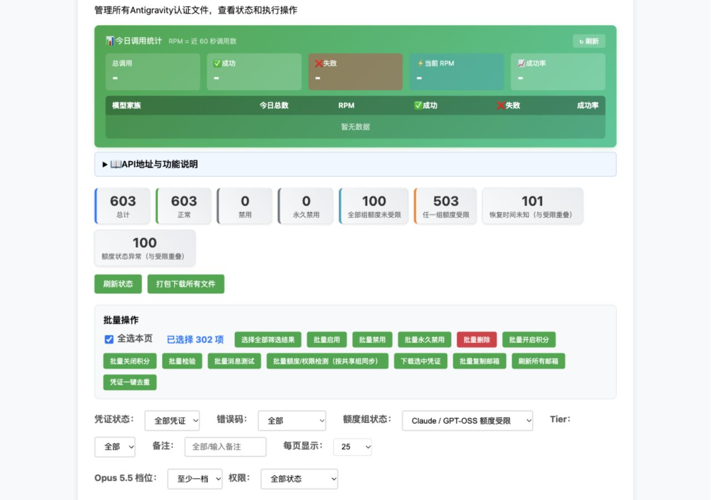
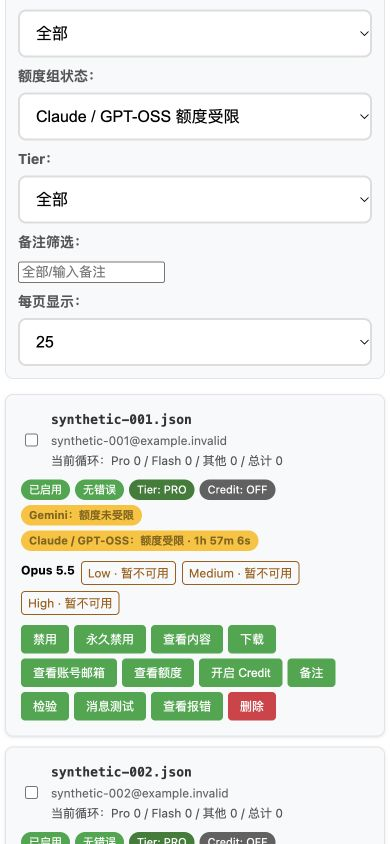

# Antigravity 共享额度组筛选修复

2026-10-04，基于 `d1004`，交付分支为 `d1004-1`。本记录描述本地隔离验收，不包含线上部署验收；未修改生产数据库、凭证、Zeabur Volume 或面板版本号。推送该分支已获用户明确授权，是否自动部署由 Zeabur 的分支绑定配置决定。

## 修改与兼容

桌面、实际移动模板的 Antigravity 筛选改为 Gemini、Claude / GPT-OSS 两组及全部组的额度受限/未受限。判定包含未来计时冷却、恢复时间未知的 `blocked_unknown`；损坏额度策略与最终准入一致，整凭证受限。`manual_override` 与计时期限独立，历史 Opus 4.6 冷却继续保护共享组。其他未知模型保持独立组，Opus 权限、启用状态、容量退避分别判断。

四种存储摘要直接批量读取已有策略字段。SQLite 有界与旧查询结果一致；PostgreSQL 的 Antigravity 全局状态统计使用现有 INTEGER 字段对应的谓词；MySQL 保留 `server_name` 隔离和现有禁用表示；MongoDB 已存永久禁用标记仅从新额度计数中排除。列表、筛选、统计与到期刷新不查询 Google、不刷新 Token、不初始化凭证代次、不写模型调用统计。

列表新增面板 capability `antigravity.cooldown.group_filter`、可选 `quota_groups` / `quota_state_invalid`、四种全局额度计数及 `quota_next_expiry`。能力仅在成功读取时声明，不支持的新筛选返回 501。旧定时冷却筛选值与统计继续兼容，Gemini CLI 专属行为和历史调用归属不变。

到期时间来自完整候选/统计读取，空筛选结果和分页外冷却也能触发合并缓存刷新。失败重试至少间隔 15 秒，隐藏页面不自动查询，未知期限拦截不随时间自行解除。额度详情在无模型卡片或查询失败但存在保护数据时仍展示状态；人工解除后刷新缓存列表；批量同步文案说明返回成员与共享组规则。修正 Antigravity 全选框 ID 查找，跨页选择的数量、当前页勾选和部分选中状态同步，Gemini CLI 查找保持原样。

Management schema **1.4**、能力/动作枚举均未改动，manager 无需配套动作：`no_counterpart_action`。无需迁移。撤销本次代码即可回到现有额度保护版本，保留原始数据和限制。

接口与使用说明见 [额度保护文档](../../ANTIGRAVITY_QUOTA_PROTECTION.md#凭证列表的共享组筛选)。

## 验证

最终完整隔离回归：**2238 passed，8 项已有弃用警告，37.67 秒**，包含 Management 契约和 Legacy 回归。[完整输出](regression.txt)。

前端实际函数行为测试：**13 passed**，涵盖能力降级、分组卡片、跨页参数与真实模板复选框同步、同名凭证隔离、隐藏页面、失败节流、空筛选页到期刷新、异常状态、无模型额度详情、失败查询保护、人工解除后的缓存刷新。[输出](frontend.txt)。JavaScript 语法和差异检查通过。

```sh
PYTHONPATH=/private/tmp/gcli-opus55-test-deps .venv/bin/python scripts/run_diagnostic_tests.py -q --tb=short
node --test test_antigravity_cooldown_ui.cjs
node --check front/common.js
git -c core.fsmonitor=false diff --check
```

完整测试中的回环 HTTP 场景需要允许本机监听。首次在受限沙箱执行有 29 项因监听权限失败；确认均为 `PermissionError` 后，在相同隔离 runner 下获得本机监听授权并重新执行，最终全部通过。

使用真实临时 SQLite 数据库及 PostgreSQL/MySQL/MongoDB 驱动替身执行实际摘要方法，未连接真实远程数据库。覆盖三协议既有回归、六个新筛选、旧参数、共享组最大期限、精确到期边界、未知独立组、异常 JSON、非法修订号、布尔/字符串/NaN/Infinity/超大整数期限、只读数据不变、603 条凭证的权限与额度组合分页，以及不支持和读取失败的 capability 降级。

## 浏览器检查

使用 Browser 技能，在仅绑定 `127.0.0.1` 的本地组件预览检查实际桌面/移动模板的 Antigravity 区块、CSS 和 `common.js` 列表函数；`/creds/status` 使用 603 个合成凭证和纯状态归类模拟。此浏览器检查不是线上 p04/p05 验收，也不是实际 Google 目录或生成验证。

| 场景 | 结果 |
| --- | --- |
| Claude / GPT-OSS 额度受限 | 302 项，13 页，每页 25 项；未知期限及异常凭证保留 |
| 桌面选择全部筛选结果 | 选择 302 项，覆盖所有页；当前页 25 个复选框和全选框同步勾选 |
| 桌面 1280×900 | 两组状态独立显示，页面宽度 1280，无横向溢出 |
| 实际移动模板 390×844 | 七项筛选可用，页面宽度 390，无横向溢出，卡片换行 |




