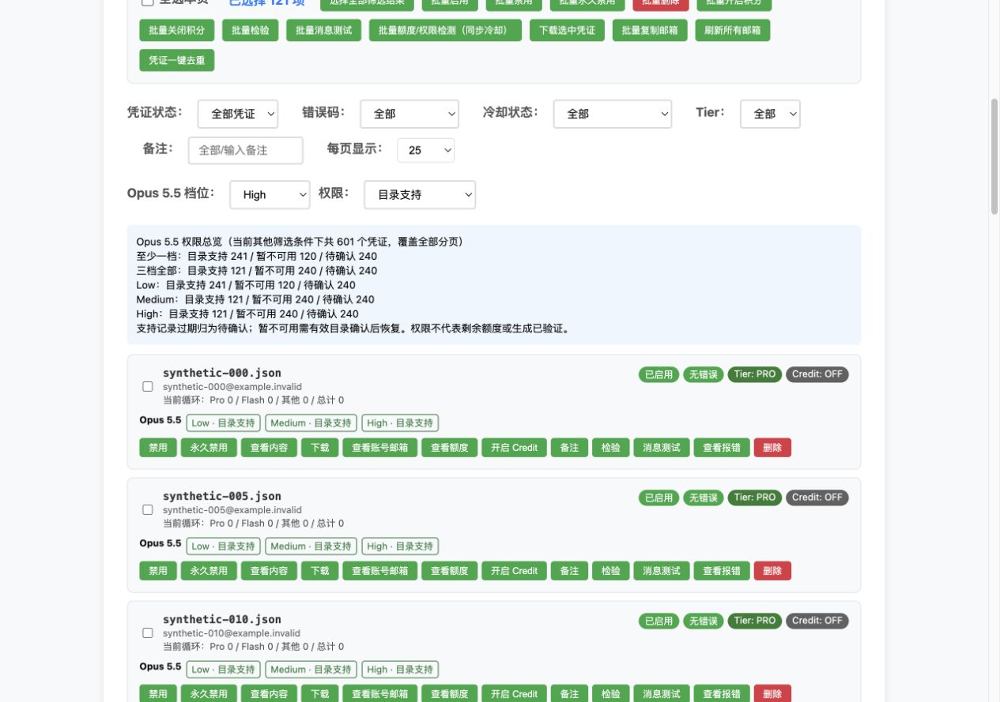
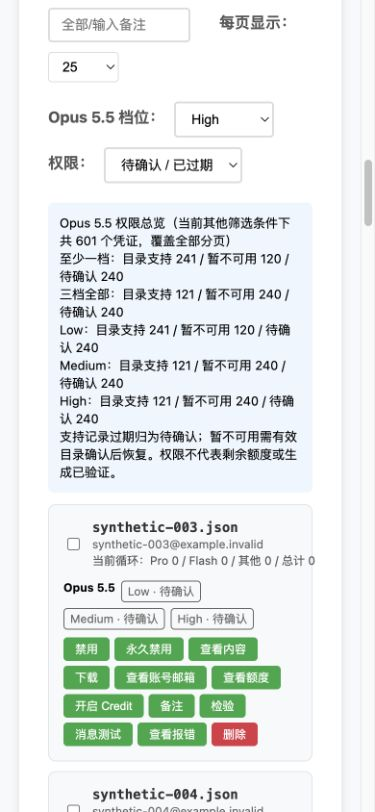

# Opus 5.5 权限总览与筛选

2026-10-04，分支 `d1004`。仅本地代码与隔离验证，未部署。

列表增加三档标签、权限数量总览、后端分页前的档位/状态筛选、跨页选择全部筛选结果。
批量额度检测弹窗增加三档权限数量和逐凭证结果；查询成功不等同于模型支持。
使用步骤、参数及状态定义见 [权限保护文档](../../ANTIGRAVITY_MODEL_ACCESS.md#数百个凭证的总览与筛选)。

完整隔离回归：**2159 passed，8 项已有弃用警告，36.10 秒**。
命令与输出：[regression.txt](regression.txt)。

```sh
PYTHONPATH=/private/tmp/gcli-opus55-test-deps .venv/bin/python scripts/run_diagnostic_tests.py -q
node --check front/common.js
git -c core.fsmonitor=false diff --check
```

新增覆盖 601 条摘要的分页前筛选、其他过滤条件组合、三档独立/部分支持、12 小时边界、
暂停到期仍不可用、未知/过期不误判、禁用凭证、身份替换及损坏状态、后端不支持时归未知、
SQL/Mongo 批量只读投影与 MySQL server_name 隔离、不返回私密字段。
实际前端函数覆盖徽章、请求参数、旧模式参数隔离、批量数量/失败提示、1005 项跨页选择、
选择失败保留旧集合、刷新保留权限字段、筛选重置页码。

浏览器验证采用实际控制面板 Antigravity 区块、CSS 和 common.js 列表函数，
搭配本地模拟 `/creds/status` 与 601 个合成凭证。没有生产凭证或线上调用。

| 检查 | 结果 |
| --- | --- |
| High / 目录支持 | 共 121 条，5 页，每页 25 条 |
| 选择全部筛选结果 | 已选择 121 项，覆盖所有页 |
| High / 待确认或已过期 | 共 240 条，10 页 |
| 桌面 1280×900 | 控件、总览与标签正常；无横向溢出 |
| 手机 390×844 | 控件与标签换行；无横向溢出 |





不增加迁移，不修改令牌、既有额度或历史统计。
Management schema 1.4、动作枚举及 manager 要求不变；复用既有 capability
`antigravity.model_access.protection`，`no_counterpart_action`。
没有修改 panel-version.txt、部署 p04/p05 或执行真实生成。
