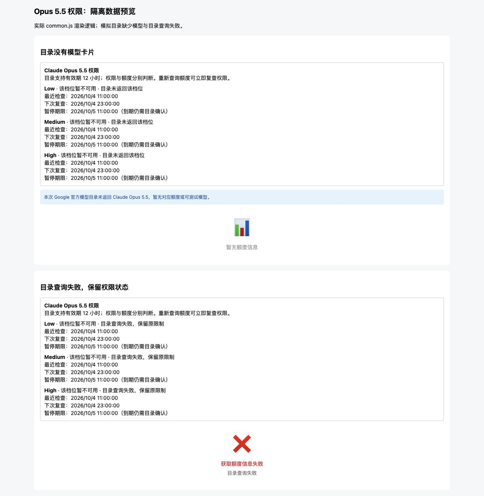
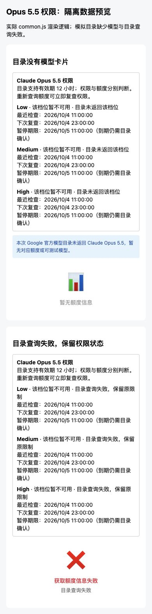

# Opus 5.5 权限保护交付证据

2026-10-04，代码交付分支 `d1004`（基于 `master`）。未执行部署。
实现、迁移和回滚说明：[按凭证权限保护](../../ANTIGRAVITY_MODEL_ACCESS.md)。

## 已完成验证

完整隔离回归：**2142 passed，8 项已有弃用警告，31.38 秒**。
完整输出：[regression.txt](regression.txt)。命令：

```sh
PYTHONPATH=/private/tmp/gcli-opus55-test-deps .venv/bin/python scripts/run_diagnostic_tests.py -q
node --check front/common.js
git -c core.fsmonitor=false diff --check
```

前端语法和差异检查均通过；修改的 Python 模块编译检查通过。
测试使用临时凭证/SQLite目录、SQL/Mongo驱动替身、模拟上游及回环服务，
清空远程数据库与代理配置。真实 PostgreSQL/MySQL/MongoDB 的部署迁移未执行。

新增测试覆盖精确档位与别名、冷启动和混合池、权限与共享额度的独立准入、
12h/24h及15分钟重试、重启、并发租约、目录/404/人工恢复交错、内容刷新、替换、删除重建、
公开目录并集、两条人工测试路径、HTTP与内嵌404、正文输出后不重放、查询超时、并发上限2、
后台查询繁忙时持续扫描，以及三协议和四类功能模式的无权限 JSON 503。
旧 Opus 4.6 拒绝、历史额度/统计保护及协议兼容回归包含在完整测试中。

## 面板显示

使用实际 common.js 的额度渲染函数和合成响应，检查没有模型卡片、查询失败两种情形。
这是隔离的组件预览，不是 p04/p05 生产截图。

| 视口 | 权限区块 | 页面宽度 | 横向溢出 |
| --- | --- | --- | --- |
| 1280×900 | 两种情形均显示三档及时间 | 1280 | 无 |
| 390×844 | 两种情形均显示三档及时间 | 390 | 无 |

桌面：



移动端：



## 兼容与剩余上线验收

Management schema 仍为 1.4，动作枚举不变，增量 capability 为
`antigravity.model_access.protection`，仅在存储验证成功后声明。
manager 无需配套动作：`no_counterpart_action`。
无 panel-version.txt 变更，无令牌/既有额度/历史统计重写。

没有运行真实生成、生产数据库迁移或部署。正式上线仍需指定环境及真实生成次数。
回滚保留新增状态字段和原始数据；旧版本不具备本次权限筛选保护。
