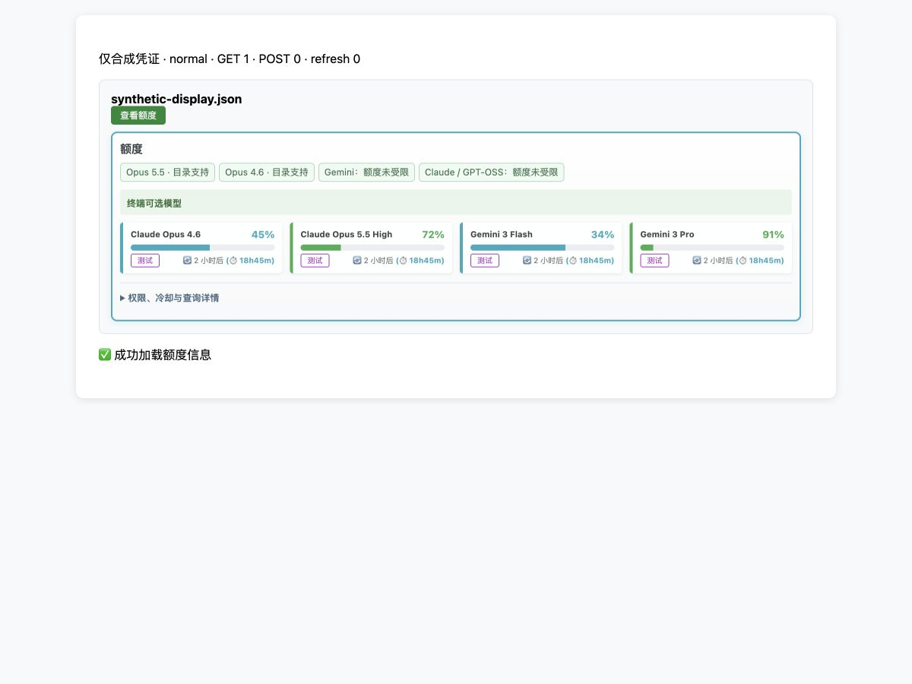

# Antigravity 查看额度：额度优先交付记录

基于 `d1004-1 / 4e5edee` 完成本地修改与验证。用户随后明确授权将本次变更
提交并推送至 `origin/d1004-1`；手工面板版本号保持不变。验收未查询生产凭证，
Git 推送不作为 p08 部署成功或线上验收的证据。

## 当前行为

- 原地展开依次显示紧凑标题、两个 Opus 版本及两个共享组的状态、必要警告、
  模型额度卡片、默认折叠的「权限、冷却与查询详情」。不重复显示文件名。
- 权限完整时间、共享组保护、HTTP 阶段、状态同步记录及缺少 5.5 的长提示保留在详情内。
  展开、收起辅助详情只改变 DOM，不查询额度。模型排序、真实 ID、额度、恢复时间和测试按钮保持。
- 查询失败或部分同步失败仍有顶部提示。空模型与全部隐藏模型有明确空态。
  状态异常不能遮住未知恢复时间证据，字段缺失不当作解除限制。
- 网络失败保留列表已保存的权限与保护信息；完整错误保留在详情内。
  未提供已存信息时显示待确认，不生成可用凭证或额度。
- 人工解除在详情内保留；顶部状态暂标待刷新，随后刷新列表，不再次查询 Google。
  未把保留的计时冷却显示为已解除。
- 第一张卡片的名称、百分比未完整进入视口时才自动定位。
  收起、切换页面、节点被替换及过期响应不滚动；收起或过期的响应不覆盖内容。
  减少动态效果偏好使用直接定位。滚动预留 16px，避免展开动画结束后切掉行底。

只修改 Antigravity 渲染分支及两套模板的专属 CSS；Gemini CLI 保留原有布局。
后端接口、权限调度、额度状态、数据库与手工面板版本文件均未修改。
Management schema、capability、动作枚举无变化，manager 无需动作：`no_counterpart_action`。

## 验证证据

相关隔离 Python 回归 **207 passed，8 条既有弃用警告**：

```sh
PYTHONPATH=/private/tmp/gcli-opus55-test-deps .venv/bin/python scripts/run_diagnostic_tests.py -q --tb=short test_antigravity_manual.py test_antigravity_opus_panel_ui.py test_antigravity_access_overview.py test_model_routing_panel.py test_panel_embed.py test_management_api.py test_management_openapi.py test_versioning.py
```

Node **29 passed，0 failed**：

```sh
node --test test_antigravity_cooldown_ui.cjs test_antigravity_quota_layout.cjs
```

覆盖真实渲染函数的排序、ID、未知额度、滚动 168h、空态、失败证据、部分更新、
独立组限制、默认折叠、解除、可见性、减少动态效果、收起与重新展开竞态。
`node --check front/common.js` 和 `git diff --check` 通过。

实际浏览器使用只绑定 loopback 的合成验收页，复用桌面、移动模板的真实 CSS
和额度渲染、展开、解除函数；未启动生产应用或连接 Google。验证结果：

- 桌面 1200×900，首行额度可见、详情默认关闭，无横向溢出。
- 移动端 375×812、320×740，无横向溢出，权限暂停与未知恢复限制保持可见。
- 展开、键盘收起详情均保持 GET 1、POST 0；模拟解除后 GET 1、POST 1、列表刷新 1。
- 375×260 的小视口触发自动定位；动画结束后首行底部为 252.89px，在 260px 视口内。
- HTTP 403 查询失败时，错误摘要与已保存的保护证据可见，详情默认关闭。

这是本地合成额度区域验收，不代表 p08 部署验收或完整登录流程验收。
本轮未重复全仓测试；上述结果仅指列出的相关回归。

## 截图



[375px 移动端](quota-priority-mobile-375.jpg)、[320px 受限状态](quota-priority-mobile-320.jpg)、
[320px 查询失败](quota-priority-error-320.jpg)。全部使用合成文件名和数据。

回滚只撤回本次前端代码，原始数据、权限证据和共享额度保护保持。
