# gcli2api统一管理系统完整实施路线图

状态：**Draft for Review**

路线图版本：`implementation-roadmap-1.3`（2026-08-31）

## 1. 目的和权威性

本路线图把统一管理系统从基础骨架推进到20台节点生产运行所需的全部工作预先拆分为
`MGMT-001`至`MGMT-012`。它是工作项范围、依赖、顺序和验收标准的权威来源；GitHub
Issue用于跟踪状态，PR用于交付实现，handoff用于跨仓库投递，均不得静默扩大本文件定义
的范围。

任何`MGMT-*`任务开始前必须同时满足：

1. 本文件中已经存在完整任务定义；
2. 所有前置工作项已经达到要求的发布门禁；
3. 目标仓库存在同编号Issue或用户明确启动该编号任务；
4. 分支基线、输入数据、测试条件和回滚方式已经确认；
5. 跨仓任务在两个仓库使用相同编号。

仅创建分支不代表任务已经定义或可以实施。Codex不得根据分支名、阶段名或上一个任务的
结尾自行推测下一任务范围。

本仓库为单人所有者项目，`Review`不要求额外GitHub reviewer。唯一仓库所有者对指定
路线图或PR的明确批准可满足人工Review条件；Codex不得自行批准，CI通过也不能替代该批准。
所有者批准不豁免依赖、共享文档哈希、测试、handoff、安全、灰度和回滚门禁。

## 2. 已确认的总体方案

- 20台gcli2api节点继续部署在Zeabur，各自持有真实凭证、本地SQLite和最终状态；
- gcli2api-manager作为独立Zeabur Web服务，只通过HTTPS API访问节点；
- manager使用腾讯云TDSQL-C MySQL 8独立逻辑库`gcli2api_manager`；
- manager只使用一个受限数据库账号，供运行时、Alembic和人工排障共用；
- 首版只提供一个Web管理员，不实现注册、RBAC、团队或多租户；
- manager不保存完整凭证，不迁移、复制或自动调度凭证；
- manager通过Modern、Legacy Current、Legacy Minimal和Unknown适配器兼容不同版本；
- Web前端采用React、Vite、TypeScript、Ant Design和ProComponents紧凑运维控制台；
- 亮色、暗色和跟随系统由用户选择，配色层次参考Cockpit Tools但不复制源码或品牌；
- new-api只在本路线图中接收未来规划占位，不读取、不修改、不自动调整；
- 桌面端是完全独立产品，不共享数据库、账号、`servers`表、任务或发布流程。

## 3. 工作项状态和执行流程

### 3.1 状态

| 状态 | 含义 | 是否可编码 |
|---|---|---|
| `planned` | 已定义但前置条件未满足 | 否 |
| `ready` | 定义、输入和依赖完整 | 是，需用户启动任务 |
| `in_progress` | 正在实现 | 是 |
| `review` | PR、测试和交付材料等待Review | 仅修复本工作项问题 |
| `blocked` | 缺少必要输入或外部条件 | 否，不得猜测绕过 |
| `done` | 验收、合并和handoff均完成 | 否 |

### 3.2 每个工作项的固定流程

1. **准备**：核对路线图定义、依赖、GitHub Issue、handoff和工作树。
2. **定界**：在任务开头列出本次范围、排除项、契约影响、输入和回滚。
3. **分支**：manager从最新`main`创建短分支；gcli2api从最新`dev8`创建短分支。
4. **先容忍后提供**：跨仓能力先让manager容忍新旧响应，再实现gcli2api服务端。
5. **验证**：执行工作项指定的单元、集成、契约、Legacy、安全和UI测试。
6. **Review**：PR必须关联工作项、对应仓库PR和测试证据，不允许顺带实现范围外发现。
7. **交接**：对端有动作时生成`ready`handoff；没有动作时生成
   `no_counterpart_action`记录；禁止人工复制交接块。
8. **完成**：只有验收、回滚、文档、PR和handoff全部完成后才能标记`done`。
9. **下一项**：只把依赖已满足的工作项标记为`ready`，不得自动调用Codex或自动编码。

## 4. 总体依赖和发布门禁

```mermaid
flowchart LR
  A["MGMT-001 基础骨架"] --> B["MGMT-002 节点注册与安全探测"]
  B --> C["MGMT-003 Legacy只读聚合"]
  C --> D["MGMT-004 Modern V1只读协议"]
  D --> E["MGMT-005 凭证写操作与审计"]
  E --> F["MGMT-006 Preview与额度等主动操作"]
  F --> G["MGMT-007 负载分析与调整建议"]
  G --> H["MGMT-008 生产基础设施与安全验收"]
  H --> K["MGMT-011 算力预算与24小时恢复预测"]
  K --> L["MGMT-012 节点控制台嵌入与凭证页直达"]
  L --> I["MGMT-009 20节点兼容矩阵与灰度"]
  I --> J["MGMT-010 正式发布与持续运维"]
  J -.独立立项.-> N["NAPI-001 new-api规划"]
  J -.独立产品.-> P["DESKTOP-* 桌面端路线"]
```

| 门禁 | 达成条件 | 解锁内容 |
|---|---|---|
| G0 方案门禁 | 路线图和权威文档通过Review | MGMT-002 |
| G1 接入门禁 | 节点密钥加密、探测降级和节点隔离通过 | MGMT-003 |
| G2 只读门禁 | Legacy聚合、陈旧标记和敏感扫描通过 | MGMT-004 |
| G3 协议门禁 | Modern只读契约及Legacy回归通过 | MGMT-005 |
| G4 写安全门禁 | 幂等、逐项结果、审计和危险确认通过 | MGMT-006 |
| G5 外部操作门禁 | 并发、限流、副作用和冷却测试通过 | MGMT-007 |
| G6 生产门禁 | TLS或已记录的供应商例外、权限、网络限制、备份恢复、监控和安全Review通过 | MGMT-011 |
| G6.5 算力预算门禁 | 共享额度公式、手动刷新限流、数据覆盖和四类适配降级通过 | MGMT-012 |
| G6.6 嵌入安全门禁 | 深链接、Origin白名单、CSP、握手校验和旧节点回退通过 | MGMT-009 |
| G7 发布门禁 | 2台和5台灰度观察通过，无未解决P0/P1 | 全量与MGMT-010 |

## 5. 工作项总表

| 工作项 | 目标 | 仓库 | 依赖 | 当前基线状态 |
|---|---|---|---|---|
| MGMT-001 | manager基础骨架、MySQL、单管理员和前端空状态 | manager | G0前置方案 | `done`，[manager PR #2](https://github.com/lywx215/gcli2api-manager/pull/2) |
| MGMT-002 | 节点注册、密钥加密、安全探测和适配器骨架 | manager | MGMT-001 | `planned` |
| MGMT-003 | Legacy只读凭证与统计聚合、节点/凭证页面 | manager | MGMT-002 | `planned` |
| MGMT-004 | Modern V1只读Management API与兼容适配 | 两仓 | MGMT-003 | `planned` |
| MGMT-005 | 凭证写操作、任务、幂等、审计和危险确认 | 两仓 | MGMT-004 | `planned` |
| MGMT-006 | Preview、额度、测试、风险和冷却同步 | 两仓 | MGMT-005 | `planned` |
| MGMT-007 | 负载快照、趋势、热力图和人工调整建议 | manager | MGMT-006 | `planned` |
| MGMT-008 | 腾讯云数据库、Zeabur配置、备份恢复和安全验收 | manager/运维 | MGMT-007 | `done`，[manager PR #26](https://github.com/lywx215/gcli2api-manager/pull/26) |
| MGMT-011 | 算力预算、24小时恢复预测和手动额度刷新 | manager | MGMT-008 | `done`，[manager PR #30](https://github.com/lywx215/gcli2api-manager/pull/30) |
| MGMT-012 | 节点控制台嵌入、`#manage`直达和安全回退 | 两仓 | MGMT-011 | `in_progress` |
| MGMT-009 | 20台版本矩阵、RC、2/5/剩余节点灰度 | 两仓/运维 | MGMT-012 | `planned` |
| MGMT-010 | 正式发布、运行手册、告警、恢复演练和维护策略 | 两仓/运维 | MGMT-009 | `planned` |

## 6. 完整工作项定义

### MGMT-001：manager基础骨架

状态：`done`

已交付：FastAPI、SQLAlchemy Async、Alembic、MySQL 8验证、单管理员认证、CSRF、登录
限流、React/Vite/Ant Design基础界面、主题选择、CI和本地开发说明。

未交付且不得误认为已完成：节点注册、适配器、节点HTTP调用、Fixture、凭证聚合、写操作、
生产数据库连接和20台节点接入。

### MGMT-002：节点注册与安全探测

目标：建立不接触凭证内容的节点接入层，为所有后续功能提供稳定节点身份、加密密钥、能力
证据和适配器选择。

manager范围：

- `managed_nodes`、`node_secrets`、`node_capabilities`和探测记录的迁移与Repository；
- 节点新增、编辑、停用、删除、列表、详情和连接测试API；
- 使用由环境根密钥派生并分域隔离的密钥信封加密节点Token或Legacy凭证，浏览器永远不能
  回读明文；
- `ModernV1Adapter`、`LegacyCurrentAdapter`、`LegacyMinimalAdapter`、`UnknownAdapter`
  接口骨架；
- 严格执行401/403不降级，404/405/501且显式允许Legacy才进行安全只读探测；
- 节点列表、添加/编辑抽屉、探测状态、版本、revision和能力展示；
- 单节点超时、重试退避、熔断和其他节点隔离测试。

排除：凭证列表、统计聚合、写操作、真实生产节点批量导入、gcli2api代码修改。

验收：密钥扫描无泄漏；Unknown只读；错误认证不降级；迁移可恢复；UI不按版本字符串决定
能力；manager侧完成后向gcli2api发送`no_counterpart_action`记录。

### MGMT-003：Legacy只读聚合

目标：不修改任何节点的前提下，统一展示不同Legacy版本的节点摘要、凭证元数据和统计。

manager范围：

- 盘点当前20台的版本/revision，按响应结构分类，真实标识全部脱敏；
- 为Legacy Current、Legacy Minimal和Unknown建立固定Fixture；
- 规范化`get_summary`、`list_credentials`和`get_stats`；
- 保存凭证脱敏索引及快照，不保存完整JSON或Token；
- 实现分页、筛选、缓存、数据时间、陈旧标记和离线最后快照；
- 完成总览、节点详情和单节点凭证只读页面；
- 20节点并发读取、单节点失败隔离和缓存失效测试。

排除：任何凭证状态修改、主动额度调用、Modern服务端改造、生产写操作。

验收：三类Legacy/Unknown场景通过；缺失字段保持`null`；数据库、日志和浏览器无敏感字段；
所有现网结构均能安全显示或明确降级。

### MGMT-004：Modern V1只读Management API

目标：让新版节点通过稳定、脱敏、可探测的`/management/v1`替代Legacy只读访问，同时
保留所有旧节点兼容性。

顺序：

1. manager先实现对Management schema 1.0的容忍性解析和Modern只读适配器测试；
2. manager生成`MGMT-004-M-1` ready handoff；
3. gcli2api实现认证、capabilities、summary、credentials和stats；
4. gcli2api生成候选镜像及`MGMT-004-G-1` ready handoff；
5. manager运行Modern、全部Legacy和Unknown兼容矩阵。

gcli2api范围：独立router、`NODE_MANAGEMENT_TOKEN`、能力真实声明、UTC转换、分页外壳、
敏感字段排除、Legacy回归和OpenAPI基线。

排除：所有写动作、Preview、额度、测试和风险操作。

验收：未配置Token返回503，错误Token返回401；契约、OpenAPI和实现一致；Legacy接口无
回归；候选镜像可被manager识别，旧版仍正常降级。

### MGMT-005：凭证写操作、任务与审计

目标：安全实现单节点和批量凭证启用、禁用、永久禁用、备注及删除。

manager范围：

- `management_jobs`、`management_job_items`、`audit_logs`迁移及状态机；
- 单项和批量双层幂等、逐项结果、只重试失败项、操作后回读真实状态；
- 单节点凭证操作、批量选择、进度、失败重试和审计页面；
- 永久禁用和删除独立危险区、二次确认及节点离线禁写；
- manager先对新增动作响应实现容忍性测试。

gcli2api范围：动作端点、批量动作、输入校验、幂等、同凭证写串行化、明确错误码和Legacy
回归；真实状态仍由节点拥有。

排除：Preview、额度、测试、风险、跨节点迁移或自动均衡。

验收：部分成功不会重放成功项；超时后先查询再决定重试；所有写操作可审计；无能力节点
按钮禁用；删除和永久禁用必须确认。

### MGMT-006：主动外部操作

目标：实现具有外部副作用的Preview、额度、消息测试、风险检查和冷却同步，同时控制风控
风险和资源消耗。

顺序仍遵守manager容忍性实现、gcli2api提供能力、候选镜像、兼容矩阵。

范围：

- 分别声明Preview启用和关闭能力，绝不伪造不存在的关闭能力；
- 额度、测试、风险和冷却返回结构化副作用和可重试语义；
- 单节点主动调用并发默认不超过3，额度摘要默认缓存10分钟；
- UI在执行前展示可能的Token刷新、Google调用、冷却更新和失败影响；
- 模拟超时、429、Token刷新、部分失败和不支持能力。

排除：高频自动额度轮询、绕过冷却、自动调整new-api或自动迁移凭证。

验收：主动操作只能由管理员触发；并发和速率限制有效；Token不进入响应和日志；旧节点
不因缺失能力出现错误按钮。

### MGMT-007：负载分析和调整建议

目标：根据已获授权的只读统计与快照，帮助唯一管理员判断每台节点和凭证的负载，不自动
改变外部路由。

manager范围：

- 定时采集节点内部摘要和统计，不把额度/风险等外部动作变成周期任务；
- 保存有保留周期的`quota_snapshots`和`load_snapshots`；
- 计算RPM、可用凭证数、冷却率、失败率、请求密度和数据新鲜度；
- 总览趋势、节点×模型族热力图、异常节点和人工调整建议；
- 所有推算指标标注窗口、来源、计算公式和是否估算；
- 节点离线、重启导致累计值归零和快照缺口测试。

排除：new-api读取/写入、自动修改权重、自动搬运凭证、AI自动决策。

验收：指标可复算；未知值不显示为0；陈旧数据明显标识；建议不执行任何外部变更。

### MGMT-008：生产基础设施与安全验收

状态：`review`。一体镜像、独立测试库门禁和离线验收已完成；生产迁移、Zeabur部署、
数据库传输模式、备份/PITR和监控证据仍属于G6运维门禁，不得据此提前启动MGMT-009。

目标：在接入生产节点前完成数据库、Zeabur、安全、恢复和监控准备。

用户/运维动作：

- 轮换曾暴露的旧密码；创建`gcli2api_manager`，字符集`utf8mb4`，优先排序规则
  `utf8mb4_0900_ai_ci`；
- 创建唯一manager数据库账号，权限仅为`gcli2api_manager.*`上的读写，不得出现`*.*`
  或`GRANT OPTION`；
- 默认配置TLS CA校验；若已选腾讯云Serverless实例控制面明确不支持SSL，可显式配置
  `MANAGER_DB_TLS_MODE=disabled`，记录供应商限制和剩余风险，并强制把实际数据库入口限制
  到固定Zeabur出口来源；两种模式都必须配置自动备份和时间点恢复；
- 以根目录多阶段Dockerfile构建前后端同源的一体镜像，生产只运行一个无状态manager服务；
- 在Zeabur Secret中配置数据库连接和唯一长期根密钥，首次管理员通过一次性初始化口令在
  页面创建；会话、限流、操作和保留策略保存到manager数据库；
- 明确根密钥和数据库备份的独立保管及轮换方式；生产使用现有腾讯云manager数据库，所有
  自动测试、降级和恢复演练必须使用名称及权限均独立的测试库，禁止导入测试数据。

Codex范围：提供一体镜像、首次设置和设置页、脱敏配置示例、启动前校验、`SHOW GRANTS`
检查、迁移/恢复Runbook、健康检查、日志脱敏和监控规则。未经明确授权不得连接或修改生产
数据库。

验收：空库迁移、上一版本升级、备份恢复演练、权限验证、配置的数据库传输模式、网络来源
限制、密钥扫描、管理员会话和登录限流全部通过。

### MGMT-011：算力预算与24小时恢复预测

状态：`done`。manager实现、迁移、四类适配测试和G6.5证据已由PR #30交付；本工作项
未修改gcli2api Management API、schema或capability。

目标：基于manager已经保存的脱敏Tier、额度快照和模型冷却元数据，计算唯一管理员可复算的
Pro共享算力预算，并按北京时间展示未来24小时恢复分布；额度查询仍只能由管理员手动触发。

manager范围：

- 只纳入在线且已启用的manager节点、`geminicli`模式、状态为`enabled`且Tier可识别的凭证；
  离线、陈旧、禁用、永久禁用、未知Tier和缺失额度分别统计，不得填0；
- 默认Code Assist Enterprise每凭证每24小时500次、Code Assist Standard每凭证每24小时
  250次；Tier额度、别名和安全模型匹配项使用版本化规则并记录管理员修订审计；
- 模型名含独立`pro`段或被规则明确包含时归为Pro；同一凭证的全部Pro模型共享一个额度桶，
  不按模型数量重复计算；
- 剩余请求数使用`floor(日额度 * remaining_percent / 100)`；多个Pro模型值不一致时取最低
  百分比和最晚恢复时间并标记冲突，关键值缺失时保持未知；
- 返回总算力、已观测剩余、覆盖率、未来24小时恢复量和无新增消耗假设下的预计最大可用；
  恢复事件进入24个滚动小时桶，API保留UTC边界，Web按`Asia/Shanghai`24小时制展示；
- 使用现有`quota_snapshots`和凭证索引实时派生，不复制凭证正文或上游响应；为规则版本、
  手动刷新运行及其子任务关系提供MySQL/Alembic迁移；
- 新增独立算力预算页、小时恢复图、数据覆盖面板、节点/Tier明细和凭证模型详情抽屉；
- 手动刷新冻结筛选范围，按节点隔离并拆成最多100项的既有Management任务，复用10分钟
  缓存、并发/速率限制、幂等、逐项结果、失败项重试和副作用确认；进程重启后可恢复；
- Modern、Legacy Current、Legacy Minimal和Unknown均测试安全降级；缺少额度能力的节点
  不发起主动调用，只展示确实可复算的数据和未知原因。

排除：周期或高频额度轮询、绕过冷却或节点限流、把共享额度按Pro模型数放大、自动调整
new-api、自动迁移/复制凭证、根据版本字符串猜测能力，以及任何gcli2api服务端代码变化。

验收：66%示例在Enterprise/Standard分别得到330/165剩余请求；未来Pro命名可按规则识别；
北京时间跨日和24小时边界正确；快照覆盖、陈旧与冲突显式展示；手动刷新不会重放成功项，
单节点失败不影响其他节点；四类适配场景、MySQL迁移、前端三主题、窄窗口和敏感扫描通过。

### MGMT-012：节点控制台嵌入与GCLI凭证页直达

状态：`in_progress`。双仓路线图与Management schema 1.3已完成所有者Review；本增量将
`dev8`设为gcli2api管理功能基线，增加页面可配置的Management Token和双模式嵌入策略。
仍需manager先完成新capability容忍、gcli2api候选实现和G6.6证据后，MGMT-012才能标记为
`done`，MGMT-009才能重新标记为`ready`。

目标：让唯一管理员从manager的节点控制台进入对应gcli2api节点的GCLI凭证文件管理
标签页；已审核节点优先在隔离iframe中展示，不支持或不可达时安全回退到新标签。该功能
是跨域页面导航，不是凭证迁移、复制、同步或manager代办节点操作。

顺序：

1. 两仓先同步Review路线图、Management schema 1.3和两种嵌入capability语义；
2. manager实现未知capability容忍、两种嵌入策略门控、控制台入口API和新标签回退；
3. manager生成`ready`handoff后，gcli2api实现`#manage`深链接、Origin白名单、CSP和握手；
4. gcli2api发布固定候选镜像并生成`ready`handoff；
5. manager对Modern候选、当前稳定版、Legacy Current、Legacy Minimal和Unknown运行兼容矩阵。

manager范围：

- 新增“节点控制台”导航及`/node-console`、`/node-console/:nodeId`页面，列出全部节点并展示
  在线、离线和停用状态；选择状态进入URL，刷新后可恢复；
- 通过已登录只读manager API返回经服务端构造的节点入口，固定使用`/#manage`，只接受
  已注册HTTPS Base URL，不携带认证信息、凭证内容或任意用户URL；
- 仅对已启用、在线、Modern V1且声明`ui.credential_console.embed`或
  `ui.credential_console.embed.any_https`的节点尝试iframe；
  停用节点禁止打开，离线及缺失能力节点只允许新标签；
- iframe使用沙箱和`no-referrer`，不允许顶层跳转；manager不得读取iframe DOM、代理节点
  HTML、注入脚本或直接调用节点业务API；
- 只接受来源Origin和`event.source`均与所选节点匹配的版本化`postMessage`握手；超时后
  终止嵌入并展示新标签入口，新标签始终作为显式回退可用。

gcli2api范围：

- `switchTab`显式接收事件或目标按钮，不依赖全局`event`；只从白名单读取URL hash，
  `#manage`激活GCLI凭证管理，未知hash回到默认页，切换tab同步更新hash；
- `NODE_MANAGEMENT_TOKEN`支持环境变量优先和控制面板只写配置；存储层只保存摘要，页面、
  日志和响应不得回显Token或摘要；
- `GCLI_EMBED_ALLOWED_ORIGINS`支持环境变量优先和控制面板持久化。默认策略为允许任意HTTPS
  父页面，管理员可改为精确Origin白名单或完全禁用；非法环境值必须失败关闭；
- 控制面板响应按策略使用`frame-ancestors https:`、精确Origin列表或
  `frame-ancestors 'none'`，不得发送冲突的`X-Frame-Options`；
- 成功激活目标tab后，仅向匹配的允许父Origin发送
  `{"type":"gcli2api.console.ready","version":1,"tab":"manage"}`，消息不包含认证、
  凭证、配置、节点密码或业务数据；
- 精确模式只声明`ui.credential_console.embed`；任意HTTPS模式只声明
  `ui.credential_console.embed.any_https`；禁用或配置非法时两者都不声明。

排除：免登录、SSO、共享面板密码或Management Token、manager反向代理或HTML重写、
跨节点凭证迁移/复制/同步、iframe DOM访问、manager代替用户执行节点页面操作、为Legacy
或Unknown猜测嵌入能力，以及按版本字符串推断支持。

验收：未登录、已登录和刷新后`/#manage`均保持目标tab；错误hash安全回退；错误Origin、
伪造消息、HTTP URL、跨域重定向和未授权祖先被拒绝；停用、离线、能力缺失、握手超时及
浏览器存储受限均有明确回退；数据库、日志、URL和消息无敏感信息；manager先发布，随后
在2台非关键候选节点验证，再进入MGMT-009的5台和剩余节点灰度。

### MGMT-009：20节点兼容矩阵与灰度上线

目标：用可回滚的方式验证所有现网版本并逐步开放管理能力。

流程：

1. 冻结20台节点清单、版本/revision、镜像标签、适配器和能力；
2. 对最老现网版、代表Legacy版、最新稳定版和RC运行Docker/真实HTTP矩阵；
3. 选择2台非关键节点，先只读观察24小时；
4. 在2台上逐项启用低风险写操作，验证审计、回读和回滚；
5. 扩展到5台，继续观察错误率、延迟、429和冷却；
6. 达到门槛后再推广剩余节点；未知或不在矩阵中的版本保持只读；
7. 任一P0/P1、敏感泄漏、错误写入或不可恢复迁移立即停止并回滚。

验收：20台均有明确支持等级；2/5/剩余批次证据完整；manager回滚、节点镜像回滚和配置
回滚均演练；未通过版本不会被标记为完整支持。

### MGMT-010：正式发布和持续运维

目标：形成可长期维护的正式版本，而不是停留在一次性开发结果。

范围：

- 发布manager SemVer、支持矩阵、数据库迁移、回滚和已验证节点revision；
- 发布gcli2api对应固定镜像、OpenAPI、capability和Legacy影响说明；
- 建立节点离线、探测失败、任务失败、429异常、数据库连接和备份失败告警；
- 建立管理员操作、节点故障、密钥轮换、数据库恢复和版本升级Runbook；
- 定义快照和审计保留周期、备份恢复演练周期及最近3个正式版本支持策略；
- 关闭全部未解决P0/P1，记录P2/P3排期；
- 将完成状态和后续独立轨道写入路线图，不自动启动新范围。

验收：正式发布资料、监控、告警、Runbook、恢复演练和第三方Review全部可复核。

## 7. 统一默认参数和待提供输入

以下默认值随路线图一次性Review，后续任务直接使用，不再逐项询问。确需改变时通过路线图
PR统一修改。

| 类别 | 默认决策 |
|---|---|
| 节点标识 | 名称1至64字符且唯一；Base URL规范化为无尾斜杠HTTPS地址 |
| Legacy | 每节点显式开启，新增节点默认关闭；401/403永不自动降级 |
| 超时重试 | 连接5秒、普通请求15秒；只有安全GET可重试2次并指数退避，写请求不盲重试 |
| 并发刷新 | 普通只读聚合全局最多5个节点并发；单节点失败隔离 |
| 新鲜度 | 普通摘要建议60秒刷新；超过连续3个周期未成功即标记陈旧 |
| 批量写 | 单批最多100项；只重试失败项；成功项不得重放 |
| 删除 | 功能实现但默认关闭，完成2台写操作灰度后再由管理员显式开启 |
| 主动操作 | 单节点并发最多3；额度缓存10分钟；额度、风险和测试不做周期调用 |
| 算力预算 | Enterprise 500/24h、Standard 250/24h；Pro共享桶；北京时间24个滚动小时；只允许管理员手动刷新 |
| 节点控制台 | 固定`/#manage`；默认允许HTTPS父页面；可切换精确白名单或禁用；独立登录；capability优先；握手超时回退新标签；不代理、不传递凭证 |
| 负载快照 | 默认60秒采集节点内部统计；原始快照保留30天，小时聚合保留180天 |
| 审计 | 默认保留180天；危险操作不得在保留期内被应用删除 |
| 数据库 | `utf8mb4`、优先`utf8mb4_0900_ai_ci`、单一库级读写账号；默认TLS，供应商明确不支持时只允许显式无TLS模式并绑定固定Zeabur出口 |
| 备份 | 每日自动备份并启用至少7天时间点恢复；生产接入前完成一次恢复演练 |
| 灰度 | 2台只读24小时、2台写操作24小时、扩至5台24小时、再推广剩余节点 |
| 发布 | manager先发布兼容版本，再灰度gcli2api节点；未知版本始终只读 |

真正需要用户在对应门禁前提供的只有：

1. 20台节点的名称、URL、版本/revision和允许Legacy的节点清单；
2. 用于MGMT-004至MGMT-006的非生产或候选镜像测试节点；
3. MGMT-012允许嵌入的manager正式HTTPS Origin及2台非关键候选节点；
4. MGMT-009的2台和5台灰度节点名单及回滚负责人；
5. MGMT-010的正式域名、告警接收方式和维护窗口；
6. 数据库传输模式、网络来源限制、备份和Zeabur Secret已经配置完成的脱敏证明。

真实密码、Token、私钥和完整凭证不得通过Issue、handoff、Fixture或提交提供，只能进入
对应平台Secret。

### 7.1 回滚矩阵

| 工作项 | 主要回滚方式 |
|---|---|
| MGMT-001 | 回滚manager镜像；按备份策略恢复或降级基础迁移 |
| MGMT-002 | 停用节点接入路由和探测任务；降级新增表；不触碰节点状态 |
| MGMT-003 | 停止聚合调度并隐藏只读页面；保留或按迁移回滚快照表 |
| MGMT-004 | manager切回Legacy/Unknown；关闭`NODE_MANAGEMENT_TOKEN`即关闭Modern API；回滚RC镜像 |
| MGMT-005 | 全局关闭写能力并禁用UI；等待在途任务终止；回滚两端镜像，不反向重放动作 |
| MGMT-006 | 关闭主动操作capability和UI入口；停止队列，不撤销已发生的外部副作用 |
| MGMT-007 | 停止快照调度并隐藏分析页；不影响节点管理和历史审计 |
| MGMT-008 | 停止manager后恢复数据库备份、配置和密钥；未通过门禁不得接入生产节点 |
| MGMT-011 | 隐藏预算API和页面，停止未开始的刷新波次并等待在途子任务；降级新增迁移，不撤销已发生的额度查询副作用 |
| MGMT-012 | 隐藏节点控制台入口并回滚manager镜像；节点移除允许Origin、嵌入capability和候选镜像；不涉及数据库恢复 |
| MGMT-009 | 停止扩批，回滚manager和灰度节点固定镜像，保持未验证节点只读 |
| MGMT-010 | 回滚到上一个正式SemVer及其兼容数据库版本，按Runbook恢复服务 |

## 8. GitHub与Codex协调方式

- 在路线图Review通过后，一次性创建MGMT-002至MGMT-012的`planned`Issue，避免临时
  决定下一步；依赖满足时只更新状态，不重写范围；
- 用户启动任务只需说“按路线图执行MGMT-00X”，Codex必须读取本文件、该Issue和相关
  handoff，不需要用户再次复制完整需求；
- Codex不得自动连续执行下一工作项；完成后只更新持久Issue和handoff，等待用户启动；
- Issue和Actions不调用模型，账号变化不影响已经保存的任务定义和状态；
- 跨仓库PR使用同一编号并互相链接；handoff保持`queue_only`和零自动运行；
- 范围外发现进入单独记录，不能塞进当前任务或下一任务的可执行动作。

## 9. 独立后续轨道

### NAPI-001：new-api集成规划

只有MGMT-010完成后才可进入规划Review。首个工作项只盘点new-api渠道、权重、健康、容量
和审计需求，定义只读契约、人工确认、幂等和回滚，不直接实现自动调权。任何new-api实现
必须使用独立路线图和任务编号，不得回填到MGMT-001至MGMT-012。

### DESKTOP-*：桌面端

桌面端继续作为完全独立产品。若以后需要共享视觉标识或通过公开API互操作，必须单独立项；
禁止共享数据库、账号、`servers`表、迁移脚本、任务队列或运行时组件。

## 10. 路线图变更规则

- 新增范围、改变任务顺序、改变数据库边界、认证、契约或生产灰度策略必须更新本文件并
  经过双仓Review；
- 只修正文案或补充非规范示例可以使用文档PR，但不得借此改变验收语义；
- 两仓库中的本文件、`COORDINATION_SPEC.md`和`MANAGEMENT_API_CONTRACT.md`必须保持
  SHA-256一致；
- 状态变化可以由Issue跟踪；工作项目标、范围、排除项和验收只能通过路线图PR修改。

## 11. 一次性启用流程

本路线图Review通过后按以下顺序一次性完成项目准备，不再逐个临时设计任务：

1. 将两个仓库的`codex/implementation-roadmap`分别提交PR并完成第三方Review；
2. manager路线图合入`main`，gcli2api路线图合入`dev8`，复核三份权威共享文档哈希；
3. 在manager一次性创建MGMT-002至MGMT-010的Issue，其中MGMT-002标记`ready`，其余
   标记`planned`并填写依赖；
4. 在gcli2api一次性创建MGMT-004、MGMT-005、MGMT-006、MGMT-009和MGMT-010对应Issue，
   初始均为`planned`并链接manager同编号Issue；
5. 将MGMT-001关联到已合并的gcli2api-manager PR #2并保持`done`；
6. 废弃此前未含实现的空`codex/mgmt-002`分支，从包含已审核路线图的最新`main`重新创建
   MGMT-002实施分支；
7. 此后用户只需说“按路线图执行MGMT-00X”；Codex自行读取定义、Issue和handoff；
8. GitHub只保存计划和状态，不自动调用模型、不自动合并、不自动部署。

### 11.1 MGMT-011增量启用

1. manager和gcli2api先同步Review本版本路线图并复核共享文件SHA-256；
2. manager创建MGMT-011 Issue；MGMT-008为`done`且路线图Review通过后才标记为`ready`；
3. gcli2api只同步共享路线图并记录`no_counterpart_action`，不得创建服务端实现范围；
4. MGMT-011实现、迁移、四类适配测试和G6.5证据完成后，才把MGMT-012标记为`ready`；
   MGMT-009仍等待MGMT-012的G6.6门禁。

### 11.2 MGMT-012增量启用

1. manager和gcli2api同步Review本版本路线图、协作规范和Management schema 1.3，复核三份
   共享文件SHA-256一致；
2. manager和gcli2api创建同编号MGMT-012 Issue；MGMT-011为`done`且协议Review通过后，
   manager工作项才标记为`ready`；
3. manager先实现capability容忍、入口API、控制台页面和安全回退，合并后发送`ready`交接；
4. gcli2api只执行交接中已定义的深链接、Origin白名单、CSP、握手和capability范围，发布
   固定候选镜像后回传`ready`交接；
5. manager完成Modern候选及全部Legacy/Unknown兼容矩阵和G6.6证据后，才把MGMT-009重新
   标记为`ready`；不得因面板能够人工打开而跳过嵌入安全验收。
